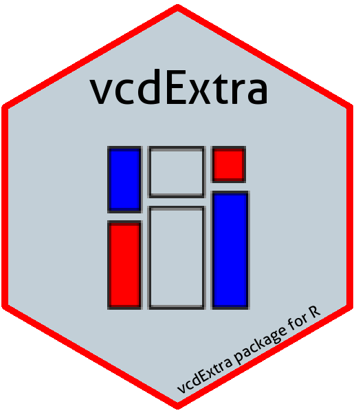

<!-- badges: start -->

<!-- badges: end -->

# vcdExtra 
## Extensions and additions to vcd: Visualizing Categorical Data 

Version 0.7-6

This package provides additional data sets, documentation, and
a few functions designed to extend the [vcd](https://CRAN.R-project.org/package=vcd) package for *Visualizing Categorical Data*
and the [gnm](https://CRAN.R-project.org/package=gnm) package for *Generalized Nonlinear Models*. 
In particular, `vcdExtra` extends mosaic, assoc and sieve plots from vcd to handle `glm()` and `gnm()` models and
adds a 3D version in `mosaic3d()`.

`vcdExtra` is now a support package for the book [*Discrete Data Analysis with R*](http://ddar.datavis.ca) by Michael Friendly and David Meyer.

### Details

The main purpose of this package is to serve as a sandbox for
introducing extensions of
mosaic plots and related graphical methods
that apply to loglinear models fitted using
`glm()` and related, generalized nonlinear models fitted
with `gnm()` in the gnm package.
A related purpose is to fill in some holes in the analysis of
categorical data in R, not provided in base R, vcd, 
or other commonly used packages.

* The method `mosaic.glm()` 
extends the `mosaic.loglm()` method in the vcd
package to this wider class of models.  This method also works for
the generalized nonlinear models fit with the gnm package,
including models for square tables and models with multiplicative associations.

* `mosaic3d()`
introduces a 3D generalization of mosaic displays using the
[rgl](https://CRAN.R-project.org/package=rgl) package.

* A new class, `glmlist`, is introduced for working with
collections of glm objects, e.g., `Kway()` for fitting
all K-way models from a basic marginal model, and `LRstats()`
for brief statistical summaries of goodness-of-fit for a collection of
models.

* For square tables with ordered factors, `Crossings()` supplements the 
specification of terms in model formulas using
`Symm()`,
`Diag()`, 
`Topo(),` etc. in the [gnm](https://CRAN.R-project.org/package=gnm) package.

* In addition, there are many new data sets, a tutorial vignette,
_Working with categorical data with R and the vcd package_, `vignette("vcd-tutorial", package = "vcdExtra")`,
and a few useful utility functions for manipulating categorical data sets and working with models for
categorical data. 

## Installation

Get the released version from CRAN:

     install.packages("vcdExtra")

The development version can be installed to your R library directly from this repo via:

     if (!require(remotes)) install.packages("remotes")
     remotes::install_github("friendly/vcdExtra")
