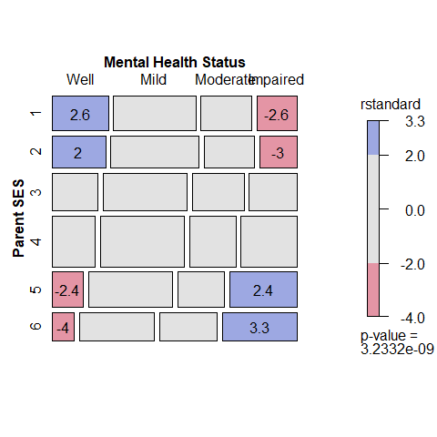

<!-- README.md is generated from README.Rmd. Please edit that file -->

<!-- badges: start -->

[](https://cran.r-project.org/package=vcdExtra)
[](https://friendly.r-universe.dev/vcdExtra)
[](https://github.com/friendly/vcdExtra/)
[](https://cran.r-project.org/package=vcdExtra)
[](https://lifecycle.r-lib.org/articles/stages.html#stable)
[](https://www.gnu.org/licenses/gpl-2.0.html)
[](https://github.com/friendly/vcdExtra/actions/workflows/R-CMD-check.yaml)

<!-- badges: end -->

# vcdExtra 

## Extensions and additions to vcd: Visualizing Categorical Data

<!-- Version 0.8-6 -->

Version 0.9.0; documentation built for `pkgdown` 2026-01-20

This package provides additional data sets, documentation, and many
functions designed to extend the
[vcd](https://CRAN.R-project.org/package=vcd) package for *Visualizing
Categorical Data* and the [gnm](https://CRAN.R-project.org/package=gnm)
package for *Generalized Nonlinear Models*. In particular, `vcdExtra`
extends mosaic, assoc and sieve plots from vcd to handle `glm()` and
`gnm()` models and adds a 3D version in `mosaic3d()`.

It also adds extensions to modeling functions for models fit using
`glm()` and `MASS::loglm()`, using the contruct `glmlist()` to construct
a list of related models which can be summarized (via `LRstats()`) and
graphed (via `mosaic.glmlist()`)

`vcdExtra` is a support package for the book [*Discrete Data Analysis
with
R*](https://www.routledge.com/Discrete-Data-Analysis-with-R-Visualization-and-Modeling-Techniques-for/Friendly-Meyer/p/book/9781498725835)
(DDAR) by Michael Friendly and David Meyer. There is also a [web site
for DDAR](http://ddar.datavis.ca) with all figures and code samples from
the book. It is also used in my graduate course, [Psy 6136: Categorical
Data Analysis](https://friendly.github.io/psy6136/).

## Installation

Get the released version from CRAN:

     install.packages("vcdExtra")

The current development version can be installed from
[R-universe](https://friendly.r-universe.dev/vcdExtra) or directly from
the [GitHub repo](https://github.com/friendly/vcdExtra) via:

     if (!require(remotes)) install.packages("remotes")
     
     install.packages("mvinfluence", repos = c('https://friendly.r-universe.dev')
     # or
     remotes::install_github("friendly/vcdExtra", build_vignettes = TRUE)

### Overview

The original purpose of this package was to serve as a sandbox for
introducing extensions of mosaic plots and related graphical methods
that apply to loglinear models fitted using `MASS::loglm()`, generalized
linear models using `stats::glm()` and the related, generalized
*nonlinear* models fitted with `gnm()` in the
[gnm](https://CRAN.R-project.org/package=gnm) package.

A related purpose was to fill in some holes in the analysis of
categorical data in R, not provided in base R,
[vcd](https://CRAN.R-project.org/package=vcd), or other commonly used
packages.

##### See also:

<a href="https://www.routledge.com/Discrete-Data-Analysis-with-R-Visualization-and-Modeling-Techniques-for/Friendly-Meyer/p/book/9781498725835"></a> 
   
<a href="https://friendly.github.io/psy6136/"></a> 
   
<a href="https://friendly.github.io/nestedLogit/"></a>

- My book, [*Discrete Data Analysis with R: Visualization and Modeling
  Techniques for Categorical and Count
  Data*](https://www.routledge.com/Discrete-Data-Analysis-with-R-Visualization-and-Modeling-Techniques-for/Friendly-Meyer/p/book/9781498725835)

- My graduate course, [Psy 6136: Categorical Data
  Analysis](https://friendly.github.io/psy6136/)

- A companion package,
  [`nestedLogit`](https://friendly.github.io/nestedLogit/), for fitting
  nested dichotomy logistic regression models for a polytomous response.

#### vcdExtra Highlights

##### mosaic plot extensions

- The method `mosaic.glm()` extends the `mosaic.loglm()` method in the
  vcd package to this wider class of models, e.g., models for ordinal
  factors, which can’t be handled with `MASS::loglm()`. This method also
  works for the generalized *nonlinear* models fit with the
  [gnm](https://CRAN.R-project.org/package=gnm) package, including
  models for square tables and models with multiplicative associations
  (RC models).

- `mosaic3d()` introduces a 3D generalization of mosaic displays using
  the [rgl](https://CRAN.R-project.org/package=rgl) package.

##### model extensions

- A new class, `glmlist`, is introduced for working with collections of
  glm objects, e.g., `Kway()` for fitting all K-way models from a basic
  marginal model, and `LRstats()` for brief statistical summaries of
  goodness-of-fit for a collection of models.

- Similarly, for loglinear models fit using `MASS::loglm()`, the
  function `seq_loglm()` fits a series of sequential models to the 1-,
  2-, … *n*-way marginal tables, corresponding to a variety of types of
  models for joint, conditional, mutual, … independence. It returns an
  object of class `loglmlist`, each of which is a class `loglm` object.
  The function `seq_mosaic()` generates the mosaic plots and other plots
  in the `vcd::strucplot()` framework.

- For **square tables** with ordered factors, `Crossings()` supplements
  the specification of terms in model formulas using `gnm::Symm()`,
  `gnm::Diag()`, `gnm::Topo(),` etc. in the
  [gnm](https://CRAN.R-project.org/package=gnm) package.

#### Other additions

- many new data sets; use `datasets("vcdExtra")` to see a list with
  titles and descriptions. The vignette,
  `vignette("datasets", package="vcdExtra")` provides a classification
  of these according to methods of analysis.

``` r
vcdExtra::datasets("vcdExtra")[,1]
##  [1] "Abortion"       "Accident"       "AirCrash"       "Alligator"     
##  [5] "Asbestos"       "Bartlett"       "Burt"           "Caesar"        
##  [9] "Cancer"         "Cormorants"     "CrabSatellites" "CyclingDeaths" 
## [13] "DaytonSurvey"   "Depends"        "Detergent"      "Donner"        
## [17] "Draft1970"      "Draft1970table" "Dyke"           "Fungicide"     
## [21] "GSS"            "Geissler"       "Gilby"          "Glass"         
## [25] "HairEyePlace"   "Hauser79"       "Heart"          "Heckman"       
## [29] "HospVisits"     "HouseTasks"     "Hoyt"           "ICU"           
## [33] "JobSat"         "Mammograms"     "Mental"         "Mice"          
## [37] "Mobility"       "PhdPubs"        "ShakeWords"     "TV"            
## [41] "Titanicp"       "Toxaemia"       "Vietnam"        "Vote1980"      
## [45] "WorkerSat"      "Yamaguchi87"
```

- a [collection of tutorial
  vignettes](https://cran.r-project.org/web/packages/vcdExtra/vignettes/).
  In the installed package, they can be viewed using
  `browseVignettes(package = "vcdExtra")`;

``` r
tools::getVignetteInfo("vcdExtra")[,c("File", "Title")] |> knitr::kable()
```

| File | Title |
|:-----|:------|

- a few useful utility functions for manipulating categorical data sets
  and working with models for categorical data.

## Examples

These `README` examples simply provide illustrations of using some of
the package functions in the context of loglinear models for frequency
tables fit using `glm()`, including models for *structured associations*
taking ordinality into account.

The dataset `Mental` is a data frame frequency table representing the
cross-classification of mental health status (`mental`) of 1660 young
New York residents by their parents’ socioeconomic status (`ses`). Both
are *ordered* factors.

``` r
data(Mental)
str(Mental)
## 'data.frame':    24 obs. of  3 variables:
##  $ ses   : Ord.factor w/ 6 levels "1"<"2"<"3"<"4"<..: 1 1 1 1 2 2 2 2 3 3 ...
##  $ mental: Ord.factor w/ 4 levels "Well"<"Mild"<..: 1 2 3 4 1 2 3 4 1 2 ...
##  $ Freq  : int  64 94 58 46 57 94 54 40 57 105 ...

# show as frequency table
(Mental.tab <- xtabs(Freq ~ ses+mental, data=Mental))
##    mental
## ses Well Mild Moderate Impaired
##   1   64   94       58       46
##   2   57   94       54       40
##   3   57  105       65       60
##   4   72  141       77       94
##   5   36   97       54       78
##   6   21   71       54       71
```

#### Independence model

Fit the independence model, `Freq ~ mental + ses`, using
`glm(..., family = poisson)` This model is equivalent to the
`chisq.test(Mental)` for general association; it does not take
ordinality into account. `LRstats()` provides a compact summary of fit
statistics for one or more models.

``` r
indep <- glm(Freq ~ mental + ses,
             family = poisson, data = Mental)
LRstats(indep)
## Likelihood summary table:
##          AIC    BIC LR Chisq Df Pr(>Chisq)    
## indep 209.59 220.19   47.418 15  3.155e-05 ***
## ---
## Signif. codes:  0 '***' 0.001 '**' 0.01 '*' 0.05 '.' 0.1 ' ' 1
```

`mosaic.glm()` is the mosaic method for `glm` objects. The default
mosaic display for these data:

``` r
mosaic(indep)
```

<!-- -->

It is usually better to use *standardized residuals*
(`residuals_type="rstandard"`) in mosaic displays, rather than the
default Pearson residuals. Here we also add longer labels for the table
factors (`set_varnames`) and display the values of residuals
(`labeling=labeling_residuals`) in the cells.

The strucplot `formula` argument, `~ ses + mental` here gives the order
of the factors in the mosaic display, not the statistical model for
independence. That is, the unit square is first split by `ses`, then by
`mental` within each level of `ses`.

``` r
# labels for table factors
long.labels <- list(set_varnames = c(mental="Mental Health Status", 
                                     ses="Parent SES"))

mosaic(indep, formula = ~ ses + mental,
       residuals_type="rstandard",
       labeling_args = long.labels, 
       labeling=labeling_residuals)
```

<!-- -->

The **opposite-corner** pattern of the residuals clearly shows that
association between Parent SES and mental health depends on the
*ordered* levels of the factors: higher Parent SES is associated with
better mental health status. A principal virtue of mosaic plots is to
show the pattern of association that remains after a model has been fit,
and thus help suggest a better model.

#### Ordinal models

Ordinal models use **numeric** scores for the row and/or column
variables. These models typically use equally spaced *integer* scores.
The test for association here is analogous to a test of the correlation
between the frequency-weighted scores, carried out using `CMHtest()`.

In the data, `ses` and `mental` were declared to be ordered factors, so
using `as.numeric(Mental$ses)` is sufficient to create a new `Cscore`
variable. Similarly for the numeric version of `mental`, giving
`Rscore`.

``` r
Cscore <- as.numeric(Mental$ses)
Rscore <- as.numeric(Mental$mental)
```

Using these, the term `Rscore:Cscore` represents an association
constrained to be **linear x linear**; that is, the slopes for profiles
of mental health status are assumed to vary linearly with those for
Parent SES. (This model asserts that only one parameter (a local odds
ratio) is sufficient to account for all association, and is also called
the model of “uniform association”.)

``` r
# fit linear x linear (uniform) association.  Use integer scores for rows/cols 
Cscore <- as.numeric(Mental$ses)
Rscore <- as.numeric(Mental$mental)

linlin <- glm(Freq ~ mental + ses + Rscore:Cscore,
              family = poisson, data = Mental)
mosaic(linlin, ~ ses + mental,
       residuals_type="rstandard", 
       labeling_args = long.labels, 
       labeling=labeling_residuals, 
       suppress=1, 
       gp=shading_Friendly,
       main="Lin x Lin model")
```

<!-- -->

Note that the test for linear x linear association consumes only 1
degree of freedom, compared to the `(r-1)*(c-1) = 15` degrees of freedom
for general association.

``` r
anova(linlin, test="Chisq")
## Analysis of Deviance Table
## 
## Model: poisson, link: log
## 
## Response: Freq
## 
## Terms added sequentially (first to last)
## 
## 
##               Df Deviance Resid. Df Resid. Dev  Pr(>Chi)    
## NULL                             23    217.400              
## mental         3  113.525        20    103.875 < 2.2e-16 ***
## ses            5   56.457        15     47.418 6.543e-11 ***
## Rscore:Cscore  1   37.523        14      9.895 9.035e-10 ***
## ---
## Signif. codes:  0 '***' 0.001 '**' 0.01 '*' 0.05 '.' 0.1 ' ' 1
```

Other models are possible between the independence model,
`Freq ~ mental + ses`, and the saturated model
`Freq ~ mental + ses + mental:ses`. The `update.glm()` method make these
easy to specify, as addition of terms to the independence model.

``` r
# use update.glm method to fit other models

linlin <- update(indep, . ~ . + Rscore:Cscore)
roweff <- update(indep, . ~ . + mental:Cscore)
coleff <- update(indep, . ~ . + Rscore:ses)
rowcol <- update(indep, . ~ . + Rscore:ses + mental:Cscore)
```

**Compare the models**: For `glm` objects, the `print` and `summary`
methods give too much information if all one wants to see is a brief
summary of model goodness of fit, and there is no easy way to display a
compact comparison of model goodness of fit for a collection of models
fit to the same data.

`LRstats()` provides a brief summary for one or more models fit to the
same dataset. The likelihood ratio $\chi^2$ values (`LR Chisq`)test lack
of fit. By these tests, none of the ordinal models show significant lack
of fit. By the AIC and BIC statistics, the `linlin` model is the best,
combining parsimony and goodness of fit.

``` r
LRstats(indep, linlin, roweff, coleff, rowcol)
## Likelihood summary table:
##           AIC    BIC LR Chisq Df Pr(>Chisq)    
## indep  209.59 220.19   47.418 15  3.155e-05 ***
## linlin 174.07 185.85    9.895 14     0.7698    
## roweff 174.45 188.59    6.281 12     0.9013    
## coleff 179.00 195.50    6.829 10     0.7415    
## rowcol 179.22 198.07    3.045  8     0.9315    
## ---
## Signif. codes:  0 '***' 0.001 '**' 0.01 '*' 0.05 '.' 0.1 ' ' 1
```

The `anova.glm()` function gives tests of nested models.

``` r
anova(indep, linlin, roweff, test = "Chisq")
## Analysis of Deviance Table
## 
## Model 1: Freq ~ mental + ses
## Model 2: Freq ~ mental + ses + Rscore:Cscore
## Model 3: Freq ~ mental + ses + mental:Cscore
##   Resid. Df Resid. Dev Df Deviance  Pr(>Chi)    
## 1        15     47.418                          
## 2        14      9.895  1   37.523 9.035e-10 ***
## 3        12      6.281  2    3.614    0.1641    
## ---
## Signif. codes:  0 '***' 0.001 '**' 0.01 '*' 0.05 '.' 0.1 ' ' 1
```

## References

Friendly, M. & Meyer, D. (2016). *Discrete Data Analysis with R:
Visualization and Modeling Techniques for Categorical and Count Data*.
Boca Raton, FL: Chapman & Hall/CRC.
