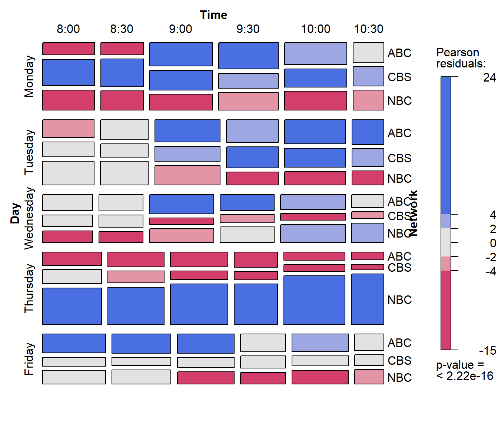

# 1. Creating and manipulating frequency tables

R provides many methods for creating frequency and contingency tables.
Several are described below. In the examples below, we use some real
examples and some anonymous ones, where the variables `A`, `B`, and `C`
represent categorical variables, and `X` represents an arbitrary R data
object.

### Forms of frequency data

The first thing you need to know is that categorical data can be
represented in three different forms in R, and it is sometimes necessary
to convert from one form to another, for carrying out statistical tests,
fitting models or visualizing the results. Once a data object exists in
R, you can examine its complete structure with the
[`str()`](https://rdrr.io/r/utils/str.html) function, or view the names
of its components with the
[`names()`](https://rdrr.io/r/base/names.html) function.

#### Case form

Categorical data in case form are simply data frames containing
individual observations, with one or more factors, used as the
classifying variables. In case form, there may also be numeric
covariates. The total number of observations is `nrow(X)`, and the
number of variables is `ncol(X)`.

***Example***:

The `Arthritis` data is available in case form in the `vcd` package.
There are two explanatory factors: `Treatment` and `Sex`. `Age` is a
numeric covariate, and `Improved` is the response— an ordered factor,
with levels None \< Some \< Marked. Excluding `Age`, this represents a
\\2 \times 2 \times 3\\ contingency table for `Treatment`, `Sex` and
`Improved`, but in case form.

``` r
names(Arthritis)      # show the variables
## [1] "ID"        "Treatment" "Sex"       "Age"       "Improved"

str(Arthritis)        # show the structure
## 'data.frame':    84 obs. of  5 variables:
##  $ ID       : int  57 46 77 17 36 23 75 39 33 55 ...
##  $ Treatment: Factor w/ 2 levels "Placebo","Treated": 2 2 2 2 2 2 2 2 2 2 ...
##  $ Sex      : Factor w/ 2 levels "Female","Male": 2 2 2 2 2 2 2 2 2 2 ...
##  $ Age      : int  27 29 30 32 46 58 59 59 63 63 ...
##  $ Improved : Ord.factor w/ 3 levels "None"<"Some"<..: 2 1 1 3 3 3 1 3 1 1 ...

head(Arthritis,5)     # first 5 observations, same as Arthritis[1:5,] 
##   ID Treatment  Sex Age Improved
## 1 57   Treated Male  27     Some
## 2 46   Treated Male  29     None
## 3 77   Treated Male  30     None
## 4 17   Treated Male  32   Marked
## 5 36   Treated Male  46   Marked
```

#### Frequency form

Data in frequency form is also a data frame containing one or more
factors, and a frequency variable, often called `Freq` or `count`. The
total number of observations is: `sum(X$Freq)`, `sum(X[,"Freq"])` or
some equivalent form.

The number of cells in the table is given by `nrow(X)`.

***Example***: For small frequency tables, it is often convenient to
enter them in frequency form using
[`expand.grid()`](https://rdrr.io/r/base/expand.grid.html) for the
factors and [`c()`](https://rdrr.io/r/base/c.html) to list the counts in
a vector. The example below, from (Agresti, 2002) gives results for the
1991 General Social Survey, with respondents classified by sex and party
identification.

``` r
# Agresti (2002), table 3.11, p. 106
GSS <- data.frame(
  expand.grid(sex = c("female", "male"), 
              party = c("dem", "indep", "rep")),
  count = c(279,165,73,47,225,191))

GSS
##      sex party count
## 1 female   dem   279
## 2   male   dem   165
## 3 female indep    73
## 4   male indep    47
## 5 female   rep   225
## 6   male   rep   191
names(GSS)
## [1] "sex"   "party" "count"
str(GSS)
## 'data.frame':    6 obs. of  3 variables:
##  $ sex  : Factor w/ 2 levels "female","male": 1 2 1 2 1 2
##  $ party: Factor w/ 3 levels "dem","indep",..: 1 1 2 2 3 3
##  $ count: num  279 165 73 47 225 191

sum(GSS$count)
## [1] 980
```

#### Table form

Table form data is represented by a `matrix`, `array` or `table` object,
whose elements are the frequencies in an \\n\\-way table. The variable
names (factors) and their levels are given by `dimnames(X)`. The total
number of observations is `sum(X)`. The number of dimensions of the
table is `length(dimnames(X))`, and the table sizes are given by
`sapply(dimnames(X), length)`.

***Example***: The `HairEyeColor` is stored in table form in `vcd`.

``` r
str(HairEyeColor)                      # show the structure
##  'table' num [1:4, 1:4, 1:2] 32 53 10 3 11 50 10 30 10 25 ...
##  - attr(*, "dimnames")=List of 3
##   ..$ Hair: chr [1:4] "Black" "Brown" "Red" "Blond"
##   ..$ Eye : chr [1:4] "Brown" "Blue" "Hazel" "Green"
##   ..$ Sex : chr [1:2] "Male" "Female"

sum(HairEyeColor)                      # number of cases
## [1] 592

sapply(dimnames(HairEyeColor), length) # table dimension sizes
## Hair  Eye  Sex 
##    4    4    2
```

***Example***: Enter frequencies in a matrix, and assign `dimnames`,
giving the variable names and category labels. Note that, by default,
[`matrix()`](https://rdrr.io/r/base/matrix.html) uses the elements
supplied by *columns* in the result, unless you specify `byrow=TRUE`.

``` r
# A 4 x 4 table  Agresti (2002, Table 2.8, p. 57) Job Satisfaction
JobSat <- matrix(c( 1, 2, 1, 0, 
                    3, 3, 6, 1, 
                   10,10,14, 9, 
                    6, 7,12,11), 4, 4)

dimnames(JobSat) = list(
  income = c("< 15k", "15-25k", "25-40k", "> 40k"),
  satisfaction = c("VeryD", "LittleD", "ModerateS", "VeryS")
  )

JobSat
##         satisfaction
## income   VeryD LittleD ModerateS VeryS
##   < 15k      1       3        10     6
##   15-25k     2       3        10     7
##   25-40k     1       6        14    12
##   > 40k      0       1         9    11
```

`JobSat` is a **matrix**, not an object of `class("table")`, and some
functions are happier with tables than matrices. You can coerce it to a
table with [`as.table()`](https://rdrr.io/r/base/table.html),

``` r
JobSat <- as.table(JobSat)
str(JobSat)
##  'table' num [1:4, 1:4] 1 2 1 0 3 3 6 1 10 10 ...
##  - attr(*, "dimnames")=List of 2
##   ..$ income      : chr [1:4] "< 15k" "15-25k" "25-40k" "> 40k"
##   ..$ satisfaction: chr [1:4] "VeryD" "LittleD" "ModerateS" "VeryS"
```

### Ordered factors and reordered tables

In table form, the values of the table factors are ordered by their
position in the table. Thus in the `JobSat` data, both `income` and
`satisfaction` represent ordered factors, and the *positions* of the
values in the rows and columns reflects their ordered nature.

Yet, for analysis, there are times when you need *numeric* values for
the levels of ordered factors in a table, e.g., to treat a factor as a
quantitative variable. In such cases, you can simply re-assign the
`dimnames` attribute of the table variables. For example, here, we
assign numeric values to `income` as the middle of their ranges, and
treat `satisfaction` as equally spaced with integer scores.

``` r
dimnames(JobSat)$income <- c(7.5,20,32.5,60)
dimnames(JobSat)$satisfaction <- 1:4
```

For the `HairEyeColor` data, hair color and eye color are ordered
arbitrarily. For visualizing the data using mosaic plots and other
methods described below, it turns out to be more useful to assure that
both hair color and eye color are ordered from dark to light. Hair
colors are actually ordered this way already, and it is easiest to
re-order eye colors by indexing. Again
[`str()`](https://rdrr.io/r/utils/str.html) is your friend.

``` r
HairEyeColor <- HairEyeColor[, c(1,3,4,2), ]
str(HairEyeColor)
##  'table' num [1:4, 1:4, 1:2] 32 53 10 3 10 25 7 5 3 15 ...
##  - attr(*, "dimnames")=List of 3
##   ..$ Hair: chr [1:4] "Black" "Brown" "Red" "Blond"
##   ..$ Eye : chr [1:4] "Brown" "Hazel" "Green" "Blue"
##   ..$ Sex : chr [1:2] "Male" "Female"
```

This is also the order for both hair color and eye color shown in the
result of a correspondence analysis ((**ref?**)(fig:ca-haireye) below.

With data in case form or frequency form, when you have ordered factors
represented with character values, you must ensure that they are treated
as ordered in R.

Imagine that the `Arthritis` data was read from a text file.  
By default the `Improved` will be ordered alphabetically: `Marked`,
`None`, `Some` — not what we want. In this case, the function
[`ordered()`](https://rdrr.io/r/base/factor.html) (and others) can be
useful.

``` r
Arthritis <- read.csv("arthritis.txt",header=TRUE)
Arthritis$Improved <- ordered(Arthritis$Improved, 
                              levels=c("None", "Some", "Marked")
                              )
```

The dataset `Arthritis` in the `vcd` package is a data.frame in this
form With this order of `Improved`, the response in this data, a mosaic
display of `Treatment` and `Improved` ((**ref?**)(fig:arthritis) shows a
clearly interpretable pattern.

The original version of `mosaic` in the `vcd` package required the input
to be a contingency table in array form, so we convert using
[`xtabs()`](https://rdrr.io/r/stats/xtabs.html).

``` r
data(Arthritis, package="vcd")
art <- xtabs(~Treatment + Improved, data = Arthritis)
mosaic(art, gp = shading_max, split_vertical = TRUE, main="Arthritis: [Treatment] [Improved]")
```


Mosaic plot for the `Arthritis` data, showing the marginal model of
independence for Treatment and Improved. Age, a covariate, and Sex are
ignored here.

Several data sets in the package illustrate the salutary effects of
reordering factor levels in mosaic displays and other analyses. See:

- [`help(AirCrash)`](https://friendly.github.io/vcdExtra/reference/AirCrash.md)
- [`help(Glass)`](https://friendly.github.io/vcdExtra/reference/Glass.md)
- [`help(HouseTasks)`](https://friendly.github.io/vcdExtra/reference/HouseTasks.md)

The [seriate](https://CRAN.R-project.org/package=seriation) package now
contains a general method to permute the row and column variables in a
table according to the result of a correspondence analysis, using scores
on the first CA dimension.

#### Re-ordering dimensions

Finally, there are situations where, particularly for display purposes,
you want to re-order the *dimensions* of an \\n\\-way table, or change
the labels for the variables or levels. This is easy when the data are
in table form: [`aperm()`](https://rdrr.io/r/base/aperm.html) permutes
the dimensions, and assigning to `names` and `dimnames` changes variable
names and level labels respectively. We will use the following version
of `UCBAdmissions` in @ref(sec:mantel) below. [¹](#fn1)

``` r
UCB <- aperm(UCBAdmissions, c(2, 1, 3))
dimnames(UCB)[[2]] <- c("Yes", "No")
names(dimnames(UCB)) <- c("Sex", "Admit?", "Department")

# display as a flattened table
stats::ftable(UCB)
##               Department   A   B   C   D   E   F
## Sex    Admit?                                   
## Male   Yes               512 353 120 138  53  22
##        No                313 207 205 279 138 351
## Female Yes                89  17 202 131  94  24
##        No                 19   8 391 244 299 317
```

### `structable()`

For 3-way and larger tables the
[`structable()`](https://rdrr.io/pkg/vcd/man/structable.html) function
in `vcd` provides a convenient and flexible tabular display. The
variables assigned to the rows and columns of a two-way display can be
specified by a model formula.

``` r
structable(HairEyeColor)                   # show the table: default
##              Eye Brown Hazel Green Blue
## Hair  Sex                              
## Black Male          32    10     3   11
##       Female        36     5     2    9
## Brown Male          53    25    15   50
##       Female        66    29    14   34
## Red   Male          10     7     7   10
##       Female        16     7     7    7
## Blond Male           3     5     8   30
##       Female         4     5     8   64

structable(Hair+Sex ~ Eye, HairEyeColor)   # specify col ~ row variables
##       Hair Black        Brown         Red        Blond       
##       Sex   Male Female  Male Female Male Female  Male Female
## Eye                                                          
## Brown         32     36    53     66   10     16     3      4
## Hazel         10      5    25     29    7      7     5      5
## Green          3      2    15     14    7      7     8      8
## Blue          11      9    50     34   10      7    30     64
```

It also returns an object of class `"structable"` which may be plotted
with [`mosaic()`](https://rdrr.io/pkg/vcd/man/mosaic.html) (not shown
here).

``` r
HSE < - structable(Hair+Sex ~ Eye, HairEyeColor)   # save structable object
mosaic(HSE)                                        # plot it
```

### `table()` and friends

You can generate frequency tables from factor variables using the
[`table()`](https://rdrr.io/r/base/table.html) function, tables of
proportions using the
[`prop.table()`](https://rdrr.io/r/base/proportions.html) function, and
marginal frequencies using
[`margin.table()`](https://rdrr.io/r/base/marginSums.html).

For these examples, create some categorical vectors:

``` r
 n=500
 A <- factor(sample(c("a1","a2"), n, rep=TRUE))
 B <- factor(sample(c("b1","b2"), n, rep=TRUE))
 C <- factor(sample(c("c1","c2"), n, rep=TRUE))
 mydata <- data.frame(A,B,C)
```

These lines illustrate `table`-related functions:

``` r
# 2-Way Frequency Table
attach(mydata)
mytable <- table(A,B)   # A will be rows, B will be columns
mytable                 # print table
##     B
## A     b1  b2
##   a1 116 114
##   a2 138 132

margin.table(mytable, 1) # A frequencies (summed over B)
## A
##  a1  a2 
## 230 270
margin.table(mytable, 2) # B frequencies (summed over A)
## B
##  b1  b2 
## 254 246

prop.table(mytable)    # cell percentages
##     B
## A       b1    b2
##   a1 0.232 0.228
##   a2 0.276 0.264
prop.table(mytable, 1) # row percentages
##     B
## A           b1        b2
##   a1 0.5043478 0.4956522
##   a2 0.5111111 0.4888889
prop.table(mytable, 2) # column percentages
##     B
## A           b1        b2
##   a1 0.4566929 0.4634146
##   a2 0.5433071 0.5365854
```

[`table()`](https://rdrr.io/r/base/table.html) can also generate
multidimensional tables based on 3 or more categorical variables. In
this case, you can use the
[`ftable()`](https://rdrr.io/r/stats/ftable.html) or
[`structable()`](https://rdrr.io/pkg/vcd/man/structable.html) function
to print the results more attractively.

``` r
# 3-Way Frequency Table
mytable <- table(A, B, C)
ftable(mytable)
##       C c1 c2
## A  B         
## a1 b1   45 71
##    b2   59 55
## a2 b1   62 76
##    b2   76 56
```

[`table()`](https://rdrr.io/r/base/table.html) ignores missing values by
default. To include `NA` as a category in counts, include the table
option `exclude=NULL` if the variable is a vector. If the variable is a
factor you have to create a new factor using .

### `xtabs()`

The [`xtabs()`](https://rdrr.io/r/stats/xtabs.html) function allows you
to create cross-tabulations of data using formula style input. This
typically works with case-form data supplied in a data frame or a
matrix. The result is a contingency table in array format, whose
dimensions are determined by the terms on the right side of the formula.

``` r
# 3-Way Frequency Table
mytable <- xtabs(~A+B+C, data=mydata)

ftable(mytable)    # print table
##       C c1 c2
## A  B         
## a1 b1   45 71
##    b2   59 55
## a2 b1   62 76
##    b2   76 56

summary(mytable)   # chi-square test of indepedence
## Call: xtabs(formula = ~A + B + C, data = mydata)
## Number of cases in table: 500 
## Number of factors: 3 
## Test for independence of all factors:
##  Chisq = 9.888, df = 4, p-value = 0.04235
```

If a variable is included on the left side of the formula, it is assumed
to be a vector of frequencies (useful if the data have already been
tabulated in frequency form).

``` r
(GSStab <- xtabs(count ~ sex + party, data=GSS))
##         party
## sex      dem indep rep
##   female 279    73 225
##   male   165    47 191

summary(GSStab)
## Call: xtabs(formula = count ~ sex + party, data = GSS)
## Number of cases in table: 980 
## Number of factors: 2 
## Test for independence of all factors:
##  Chisq = 7.01, df = 2, p-value = 0.03005
```

### Collapsing over table factors: `aggregate()`, `margin.table()` and `apply()`

It sometimes happens that we have a data set with more variables or
factors than we want to analyse, or else, having done some initial
analyses, we decide that certain factors are not important, and so
should be excluded from graphic displays by collapsing (summing) over
them. For example, mosaic plots and fourfold displays are often simpler
to construct from versions of the data collapsed over the factors which
are not shown in the plots.

The appropriate tools to use again depend on the form in which the data
are represented— a case-form data frame, a frequency-form data frame
([`aggregate()`](https://rdrr.io/r/stats/aggregate.html)), or a
table-form array or table object
([`margin.table()`](https://rdrr.io/r/base/marginSums.html) or
[`apply()`](https://rdrr.io/r/base/apply.html)).

When the data are in frequency form, and we want to produce another
frequency data frame,
[`aggregate()`](https://rdrr.io/r/stats/aggregate.html) is a handy tool,
using the argument `FUN=sum` to sum the frequency variable over the
factors *not* mentioned in the formula.

***Example***: The data frame `DaytonSurvey` in the `vcdExtra` package
represents a \\2^5\\ table giving the frequencies of reported use
(\`\`ever used?’’) of alcohol, cigarettes and marijuana in a sample of
high school seniors, also classified by sex and race.

``` r
data("DaytonSurvey", package="vcdExtra")
str(DaytonSurvey)
## 'data.frame':    32 obs. of  6 variables:
##  $ cigarette: Factor w/ 2 levels "Yes","No": 1 2 1 2 1 2 1 2 1 2 ...
##  $ alcohol  : Factor w/ 2 levels "Yes","No": 1 1 2 2 1 1 2 2 1 1 ...
##  $ marijuana: Factor w/ 2 levels "Yes","No": 1 1 1 1 2 2 2 2 1 1 ...
##  $ sex      : Factor w/ 2 levels "female","male": 1 1 1 1 1 1 1 1 2 2 ...
##  $ race     : Factor w/ 2 levels "white","other": 1 1 1 1 1 1 1 1 1 1 ...
##  $ Freq     : num  405 13 1 1 268 218 17 117 453 28 ...
head(DaytonSurvey)
##   cigarette alcohol marijuana    sex  race Freq
## 1       Yes     Yes       Yes female white  405
## 2        No     Yes       Yes female white   13
## 3       Yes      No       Yes female white    1
## 4        No      No       Yes female white    1
## 5       Yes     Yes        No female white  268
## 6        No     Yes        No female white  218
```

To focus on the associations among the substances, we want to collapse
over sex and race. The right-hand side of the formula used in the call
to [`aggregate()`](https://rdrr.io/r/stats/aggregate.html) gives the
factors to be retained in the new frequency data frame, `Dayton.ACM.df`.

``` r
# data in frequency form
# collapse over sex and race
Dayton.ACM.df <- aggregate(Freq ~ cigarette+alcohol+marijuana, 
                           data=DaytonSurvey, 
                           FUN=sum)
Dayton.ACM.df
##   cigarette alcohol marijuana Freq
## 1       Yes     Yes       Yes  911
## 2        No     Yes       Yes   44
## 3       Yes      No       Yes    3
## 4        No      No       Yes    2
## 5       Yes     Yes        No  538
## 6        No     Yes        No  456
## 7       Yes      No        No   43
## 8        No      No        No  279
```

When the data are in table form, and we want to produce another table,
[`apply()`](https://rdrr.io/r/base/apply.html) with `FUN=sum` can be
used in a similar way to sum the table over dimensions not mentioned in
the `MARGIN` argument.
[`margin.table()`](https://rdrr.io/r/base/marginSums.html) is just a
wrapper for [`apply()`](https://rdrr.io/r/base/apply.html) using the
[`sum()`](https://rdrr.io/r/base/sum.html) function.

***Example***: To illustrate, we first convert the `DaytonSurvey` to a
5-way table using [`xtabs()`](https://rdrr.io/r/stats/xtabs.html),
giving `Dayton.tab`.

``` r
# in table form
Dayton.tab <- xtabs(Freq ~ cigarette+alcohol+marijuana+sex+race, 
                    data=DaytonSurvey)
structable(cigarette+alcohol+marijuana ~ sex+race, 
           data=Dayton.tab)
##              cigarette Yes              No            
##              alcohol   Yes      No     Yes      No    
##              marijuana Yes  No Yes  No Yes  No Yes  No
## sex    race                                           
## female white           405 268   1  17  13 218   1 117
##        other            23  23   0   1   2  19   0  12
## male   white           453 228   1  17  28 201   1 133
##        other            30  19   1   8   1  18   0  17
```

Then, use [`apply()`](https://rdrr.io/r/base/apply.html) on `Dayton.tab`
to give the 3-way table `Dayton.ACM.tab` summed over sex and race. The
elements in this new table are the column sums for `Dayton.tab` shown by
[`structable()`](https://rdrr.io/pkg/vcd/man/structable.html) just
above.

``` r
# collapse over sex and race
Dayton.ACM.tab <- apply(Dayton.tab, MARGIN=1:3, FUN=sum)
Dayton.ACM.tab <- margin.table(Dayton.tab, 1:3)   # same result

structable(cigarette+alcohol ~ marijuana, data=Dayton.ACM.tab)
##           cigarette Yes      No    
##           alcohol   Yes  No Yes  No
## marijuana                          
## Yes                 911   3  44   2
## No                  538  43 456 279
```

Many of these operations can be performed using the `**ply()` functions
in the [`plyr`](https://CRAN.R-project.org/package=plyr) package. For
example, with the data in a frequency form data frame, use
[`ddply()`](https://rdrr.io/pkg/plyr/man/ddply.html) to collapse over
unmentioned factors, and
[`plyr::summarise()`](https://rdrr.io/pkg/plyr/man/summarise.html) as
the function to be applied to each piece.

``` r
library(plyr)
Dayton.ACM.df <- plyr::ddply(DaytonSurvey, 
                             .(cigarette, alcohol, marijuana), 
                             plyr::summarise, Freq=sum(Freq))

Dayton.ACM.df
##   cigarette alcohol marijuana Freq
## 1       Yes     Yes       Yes  911
## 2       Yes     Yes        No  538
## 3       Yes      No       Yes    3
## 4       Yes      No        No   43
## 5        No     Yes       Yes   44
## 6        No     Yes        No  456
## 7        No      No       Yes    2
## 8        No      No        No  279
```

### Collapsing table levels: `collapse.table()`

A related problem arises when we have a table or array and for some
purpose we want to reduce the number of levels of some factors by
summing subsets of the frequencies. For example, we may have initially
coded Age in 10-year intervals, and decide that, either for analysis or
display purposes, we want to reduce Age to 20-year intervals. The
[`collapse.table()`](https://friendly.github.io/vcdExtra/reference/collapse.table.md)
function in `vcdExtra` was designed for this purpose.

***Example***: Create a 3-way table, and collapse Age from 10-year to
20-year intervals. First, we generate a \\2 \times 6 \times 3\\ table of
random counts from a Poisson distribution with mean of 100.

``` r
# create some sample data in frequency form
sex <- c("Male", "Female")
age <- c("10-19", "20-29",  "30-39", "40-49", "50-59", "60-69")
education <- c("low", 'med', 'high')
data <- expand.grid(sex=sex, age=age, education=education)
counts <- rpois(36, 100)   # random Possion cell frequencies
data <- cbind(data, counts)

# make it into a 3-way table
t1 <- xtabs(counts ~ sex + age + education, data=data)
structable(t1)
##                  age 10-19 20-29 30-39 40-49 50-59 60-69
## sex    education                                        
## Male   low              98   105   104    90    90   101
##        med              97   105   101    88    97   107
##        high             99   101   109    88    99    96
## Female low             102   117   101   105    85    88
##        med             106    84    92   116   110    96
##        high            106    96   121    91   107   102
```

Now collapse `age` to 20-year intervals, and `education` to 2 levels. In
the arguments, levels of `age` and `education` given the same label are
summed in the resulting smaller table.

``` r
# collapse age to 3 levels, education to 2 levels
t2 <- collapse.table(t1, 
         age=c("10-29", "10-29",  "30-49", "30-49", "50-69", "50-69"),
         education=c("<high", "<high", "high"))
structable(t2)
##                  age 10-29 30-49 50-69
## sex    education                      
## Male   <high           405   383   395
##        high            200   197   195
## Female <high           409   414   379
##        high            202   212   209
```

### Collapsing table levels: `dplyr`

For data sets in frequency form or case form, factor levels can be
collapsed by recoding the levels to some grouping. One handy function
for this is
[`dplyr::case_match()`](https://dplyr.tidyverse.org/reference/case_match.html)

***Example***:

The
[`vcdExtra::Titanicp`](https://friendly.github.io/vcdExtra/reference/Titanicp.md)
data set contains information on 1309 passengers on the *RMS Titanic*,
including `sibsp`, the number of (0:8) siblings or spouses aboard, and
`parch` (0:6), the number of parents or children aboard, but the table
is quite sparse.

``` r
table(Titanicp$sibsp, Titanicp$parch)
##    
##       0   1   2   3   4   5   6   9
##   0 790  52  43   2   2   2   0   0
##   1 183  90  29   5   4   4   2   2
##   2  26   9   6   1   0   0   0   0
##   3   3   9   8   0   0   0   0   0
##   4   0  10  12   0   0   0   0   0
##   5   0   0   6   0   0   0   0   0
##   8   0   0   9   0   0   0   0   0
```

For purposes of analysis, we might want to collapse both of these to the
levels `0, 1, 2+`. Here’s how:

``` r
library(dplyr)
Titanicp <- Titanicp |>
  mutate(sibspF = case_match(sibsp,
                            0 ~ "0",
                            1 ~ "1",
                            2:max(sibsp) ~ "2+")) |>
  mutate(sibspF = ordered(sibspF)) |>
  mutate(parchF = case_match(parch,
                             0 ~ "0",
                             1 ~ "1",
                             2:max(parch) ~ "2+")) |>
  mutate(parchF = ordered(parchF)) 

table(Titanicp$sibspF, Titanicp$parchF)
##     
##        0   1  2+
##   0  790  52  49
##   1  183  90  46
##   2+  29  28  42
```

[`car::recode()`](https://rdrr.io/pkg/car/man/recode.html) is a similar
function, but with a less convenient interface.

The [`forcats`](https://CRAN.R-project.org/package=forcats) package
provides a collection of functions for reordering the levels of a factor
or grouping categories according to their frequency:

- `forcats::fct_reorder()`: Reorder a factor by another variable.
- `forcats::fct_infreq()`: Reorder a factor by the frequency of values.
- `forcats::fct_relevel()`: Change the order of a factor by hand.
- `forcats::fct_lump()`: Collapse the least/most frequent values of a
  factor into “other”.
- `forcats::fct_collapse()`: Collapse factor levels into manually
  defined groups.
- `forcats::fct_recode()`: Change factor levels by hand.

### Converting among frequency tables and data frames

As we’ve seen, a given contingency table can be represented equivalently
in different forms, but some R functions were designed for one
particular representation.

The table below shows some handy tools for converting from one form to
another.

| **From this**    |                 | **To this**        |                    |
|:-----------------|:----------------|:-------------------|--------------------|
|                  | *Case form*     | *Frequency form*   | *Table form*       |
| *Case form*      | noop            | `xtabs(~A+B)`      | `table(A,B)`       |
| *Frequency form* | `expand.dft(X)` | noop               | `xtabs(count~A+B)` |
| *Table form*     | `expand.dft(X)` | `as.data.frame(X)` | noop               |

For example, a contingency table in table form (an object of
`class(table)`) can be converted to a data.frame with
[`as.data.frame()`](https://rdrr.io/r/base/as.data.frame.html).
[²](#fn2) The resulting `data.frame` contains columns representing the
classifying factors and the table entries (as a column named by the
`responseName` argument, defaulting to `Freq`. This is the inverse of
[`xtabs()`](https://rdrr.io/r/stats/xtabs.html).

***Example***: Convert the `GSStab` in table form to a data.frame in
frequency form.

``` r
as.data.frame(GSStab)
##      sex party Freq
## 1 female   dem  279
## 2   male   dem  165
## 3 female indep   73
## 4   male indep   47
## 5 female   rep  225
## 6   male   rep  191
```

***Example***: Convert the `Arthritis` data in case form to a 3-way
table of `Treatment` \\\times\\ `Sex` \\\times\\ `Improved`. Note the
use of [`with()`](https://rdrr.io/r/base/with.html) to avoid having to
use `Arthritis\$Treatment` etc. within the call to
[`table()`](https://rdrr.io/r/base/table.html).% [³](#fn3)

``` r
Art.tab <- with(Arthritis, table(Treatment, Sex, Improved))
str(Art.tab)
##  'table' int [1:2, 1:2, 1:3] 19 6 10 7 7 5 0 2 6 16 ...
##  - attr(*, "dimnames")=List of 3
##   ..$ Treatment: chr [1:2] "Placebo" "Treated"
##   ..$ Sex      : chr [1:2] "Female" "Male"
##   ..$ Improved : chr [1:3] "None" "Some" "Marked"

ftable(Art.tab)
##                  Improved None Some Marked
## Treatment Sex                             
## Placebo   Female            19    7      6
##           Male              10    0      1
## Treated   Female             6    5     16
##           Male               7    2      5
```

There may also be times that you will need an equivalent case form
`data.frame` with factors representing the table variables rather than
the frequency table. For example, the
[`mca()`](https://rdrr.io/pkg/MASS/man/mca.html) function in package
`MASS` only operates on data in this format. Marc Schwartz initially
provided code for
[`expand.dft()`](https://friendly.github.io/vcdExtra/reference/expand.dft.md)
on the Rhelp mailing list for converting a table back into a case form
`data.frame`. This function is included in `vcdExtra`.

***Example***: Convert the `Arthritis` data in table form (`Art.tab`)
back to a `data.frame` in case form, with factors `Treatment`, `Sex` and
`Improved`.

``` r
Art.df <- expand.dft(Art.tab)
str(Art.df)
## 'data.frame':    84 obs. of  3 variables:
##  $ Treatment: chr  "Placebo" "Placebo" "Placebo" "Placebo" ...
##  $ Sex      : chr  "Female" "Female" "Female" "Female" ...
##  $ Improved : chr  "None" "None" "None" "None" ...
```

### A complex example

If you’ve followed so far, you’re ready for a more complicated example.
The data file, `tv.dat` represents a 4-way table of size \\5 \times 11
\times 5 \times 3\\ where the table variables (unnamed in the file) are
read as `V1` – `V4`, and the cell frequency is read as `V5`. The file,
stored in the `doc/extdata` directory of `vcdExtra`, can be read as
follows:

``` r
tv.data<-read.table(system.file("extdata","tv.dat", package="vcdExtra"))
head(tv.data,5)
##   V1 V2 V3 V4 V5
## 1  1  1  1  1  6
## 2  2  1  1  1 18
## 3  3  1  1  1  6
## 4  4  1  1  1  2
## 5  5  1  1  1 11
```

For a local file, just use
[`read.table()`](https://rdrr.io/r/utils/read.table.html) in this form:

``` r
tv.data<-read.table("C:/R/data/tv.dat")
```

The data `tv.dat` came from the initial implementation of mosaic
displays in R by Jay Emerson. In turn, they came from the initial
development of mosaic displays (Hartigan & Kleiner, 1984) that
illustrated the method with data on a large sample of TV viewers whose
behavior had been recorded for the Neilsen ratings. This data set
contains sample television audience data from Neilsen Media Research for
the week starting November 6, 1995.

The table variables are:

- `V1`– values 1:5 correspond to the days Monday–Friday;
- `V2`– values 1:11 correspond to the quarter hour times 8:00PM through
  10:30PM;
- `V3`– values 1:5 correspond to ABC, CBS, NBC, Fox, and non-network
  choices;
- `V4`– values 1:3 correspond to transition states: turn the television
  Off, Switch channels, or Persist in viewing the current channel.

We are interested just the cell frequencies, and rely on the facts that
the

1.  the table is complete— there are no missing cells, so
    `nrow(tv.data)` = 825;
2.  the observations are ordered so that `V1` varies most rapidly and
    `V4` most slowly. From this, we can just extract the frequency
    column and reshape it into an array. \[That would be dangerous if
    any observations were out of order.\]

``` r
TV <- array(tv.data[,5], dim=c(5,11,5,3))                                        
dimnames(TV) <- list(c("Monday","Tuesday","Wednesday","Thursday","Friday"), 
                     c("8:00","8:15","8:30","8:45","9:00","9:15","9:30",         
                       "9:45","10:00","10:15","10:30"),                            
                     c("ABC","CBS","NBC","Fox","Other"), 
                     c("Off","Switch","Persist"))

names(dimnames(TV))<-c("Day", "Time", "Network", "State")
```

More generally (even if there are missing cells), we can use
[`xtabs()`](https://rdrr.io/r/stats/xtabs.html) (or
[`plyr::daply()`](https://rdrr.io/pkg/plyr/man/daply.html)) to do the
cross-tabulation, using `V5` as the frequency variable. Here’s how to do
this same operation with
[`xtabs()`](https://rdrr.io/r/stats/xtabs.html):

``` r
TV <- xtabs(V5 ~ ., data=tv.data)
dimnames(TV) <- list(Day = c("Monday","Tuesday","Wednesday","Thursday","Friday"), 
                     Time = c("8:00","8:15","8:30","8:45","9:00","9:15","9:30",         
                              "9:45","10:00","10:15","10:30"),                            
                     Network = c("ABC","CBS","NBC","Fox","Other"), 
                     State = c("Off","Switch","Persist"))

# table dimensions
dim(TV)
```

But this 4-way table is too large and awkward to work with. Among the
networks, Fox and Other occur infrequently. We can also cut it down to a
3-way table by considering only viewers who persist with the current
station. [⁴](#fn4)

``` r
TV2 <- TV[,,1:3,]      # keep only ABC, CBS, NBC
TV2 <- TV2[,,,3]       # keep only Persist -- now a 3 way table
structable(TV2)
##                   Time 8:00 8:15 8:30 8:45 9:00 9:15 9:30 9:45 10:00 10:15 10:30
## Day       Network                                                               
## Monday    ABC           146  151  156   83  325  350  386  340   352   280   278
##           CBS           337  293  304  233  311  251  241  164   252   265   272
##           NBC           263  219  236  140  226  235  239  246   279   263   283
## Tuesday   ABC           244  181  231  205  385  283  345  192   329   351   364
##           CBS           173  180  184  109  218  235  256  250   274   263   261
##           NBC           315  254  280  241  370  214  195  111   188   190   210
## Wednesday ABC           233  161  194  156  339  264  279  140   237   228   203
##           CBS           158  126  207   59   98  103  122   86   109   105   110
##           NBC           134  146  166   66  194  230  264  143   274   289   306
## Thursday  ABC           174  183  197  181  187  198  211   86   110   122   117
##           CBS           196  185  195  104  106  116  116   47   102    84    84
##           NBC           515  463  472  477  590  473  446  349   649   705   747
## Friday    ABC           294  281  305  239  278  246  245  138   246   232   233
##           CBS           130  144  154   81  129  153  136  126   138   136   152
##           NBC           195  220  248  160  172  164  169   85   183   198   204
```

Finally, for some purposes, we might want to collapse the 11 times into
a smaller number. Half-hour time slots make more sense. Here, we use
[`as.data.frame.table()`](https://rdrr.io/r/base/table.html) to convert
the table back to a data frame,
[`levels()`](https://rdrr.io/r/base/levels.html) to re-assign the values
of `Time`, and finally, [`xtabs()`](https://rdrr.io/r/stats/xtabs.html)
to give a new, collapsed frequency table.

``` r
TV.df <- as.data.frame.table(TV2)
levels(TV.df$Time) <- c(rep("8:00", 2),
                        rep("8:30", 2),
                        rep("9:00", 2), 
                        rep("9:30", 2), 
                        rep("10:00",2),
                            "10:30"
                        )

TV3 <- xtabs(Freq ~ Day + Time + Network, TV.df)

structable(Day ~ Time+Network, TV3)
##               Day Monday Tuesday Wednesday Thursday Friday
## Time  Network                                             
## 8:00  ABC            297     425       394      357    575
##       CBS            630     353       284      381    274
##       NBC            482     569       280      978    415
## 8:30  ABC            239     436       350      378    544
##       CBS            537     293       266      299    235
##       NBC            376     521       232      949    408
## 9:00  ABC            675     668       603      385    524
##       CBS            562     453       201      222    282
##       NBC            461     584       424     1063    336
## 9:30  ABC            726     537       419      297    383
##       CBS            405     506       208      163    262
##       NBC            485     306       407      795    254
## 10:00 ABC            632     680       465      232    478
##       CBS            517     537       214      186    274
##       NBC            542     378       563     1354    381
## 10:30 ABC            278     364       203      117    233
##       CBS            272     261       110       84    152
##       NBC            283     210       306      747    204
```

We’ve come this far, so we might as well show a mosaic display. This is
analogous to that used by Hartigan & Kleiner (1984).

``` r
mosaic(TV3, shade = TRUE,
       labeling = labeling_border(rot_labels = c(0, 0, 0, 90)))
```



This mosaic displays can be read at several levels, corresponding to the
successive splits of the tiles and the residual shading. Several trends
are clear for viewers who persist:

- Overall, there are about the same number of viewers on each weekday,
  with slightly more on Thursday.
- Looking at time slots, viewership is slightly greater from 9:00 -
  10:00 overall and also 8:00 - 9:00 on Thursday and Friday

From the residual shading of the tiles:

- Monday: CBS dominates in all time slots.
- Tuesday” ABC and CBS dominate after 9:00
- Thursday: is a largely NBC day
- Friday: ABC dominates in the early evening

## References

Agresti, A. (2002). *Categorical data analysis* (2nd ed.). Hoboken, New
Jersey: John Wiley & Sons.

Hartigan, J. A., & Kleiner, B. (1984). A mosaic of television ratings.
*The American Statistician*, *38*, 32–35.

------------------------------------------------------------------------

1.  Changing `Admit` to `Admit?` might be useful for display purposes,
    but is dangerous— because it is then difficult to use that variable
    name in a model formula. See @ref(sec:tips) for options
    `labeling_args` and `set_labels`to change variable and level names
    for displays in the `strucplot` framework.

2.  Because R is object-oriented, this is actually a short-hand for the
    function
    [`as.data.frame.table()`](https://rdrr.io/r/base/table.html).

3.  [`table()`](https://rdrr.io/r/base/table.html) does not allow a
    `data` argument to provide an environment in which the table
    variables are to be found. In the examples in @ref(sec:table) I used
    `attach(mydata)` for this purpose, but
    [`attach()`](https://rdrr.io/r/base/attach.html) leaves the
    variables in the global environment, while
    [`with()`](https://rdrr.io/r/base/with.html) just evaluates the
    [`table()`](https://rdrr.io/r/base/table.html) expression in a
    temporary environment of the data.

4.  This relies on the fact that that indexing an array drops dimensions
    of length 1 by default, using the argument `drop=TRUE`; the result
    is coerced to the lowest possible dimension.
