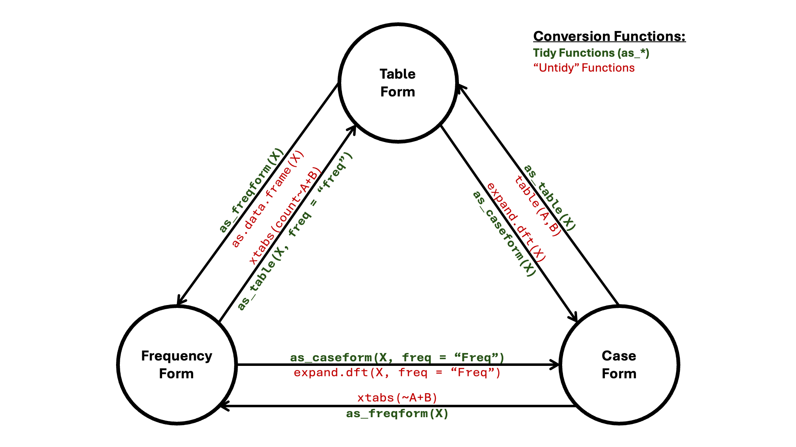
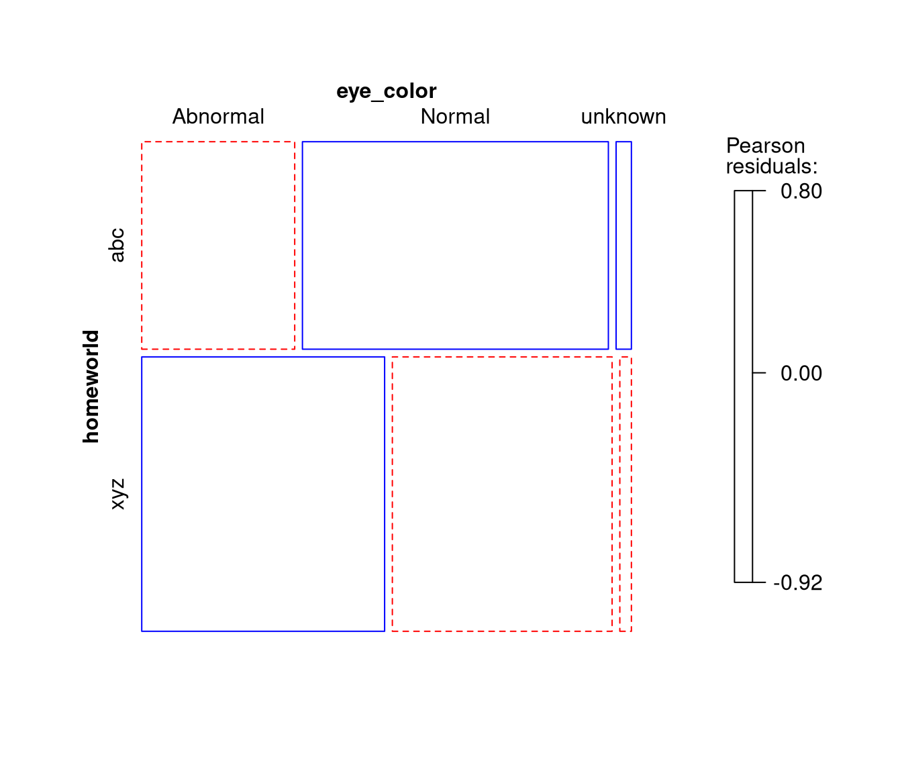

# 1a. Steps Toward Tidy Categorical Data Analysis


## Overview

While R provides many intuitive facilities for the manipulation of
continuous variables (such as those in the
[`tidyverse`](https://CRAN.R-project.org/package=tidyverse) collection
of packages), it somewhat lacks the equivalent for categorical data. Two
such areas include the collapsing of variable levels (e.g., combining
hair colours of “Brown” and “Black” into a “Dark” category) and the
conversion between forms of categorical data (e.g., from a `table` of
entries to a `data.frame` containing frequencies for each combination of
variable levels).

### Tidy Collapsing

In R, when trying to collapse levels of a variable in a dataset (e.g.,
combining hair colours of “Brown” and “Black” into a “Dark” category),
it was often the case that one would need to first convert amongst
forms, “collapse” their data, aggregate the duplicate rows, and finally
convert back to the initial form.

[`collapse_levels()`](https://friendly.github.io/vcdExtra/reference/collapse_levels.md)
simplifies this process, allowing for the intuitive collapsing of
variable levels for datasets of any form. One just needs to ensure that
an argument of `freq = "the frequency column name"` is supplied when the
inputted dataset is in frequency form.

Functionality of
[`collapse_levels()`](https://friendly.github.io/vcdExtra/reference/collapse_levels.md)
is demonstrated below using the `starwars` data from the
[`dplyr`](https://CRAN.R-project.org/package=dplyr) package. This
dataset contains case form data on various characters in the Star Wars
franchise. Variables considered in this vignette are a character’s
`hair_color`, `skin_color`, and `eye_color`. Taken as is, this would
correspond to an \\11 \times 28 \times 15\\ contingency table… Time to
collapse!

Here I load the `starwars` data and select the variables of interest.
For simplicity, I then remove rows containing `NA` values.

``` r

data("starwars", package = "dplyr")

star_case <- starwars |>
  dplyr::select(c("hair_color", "skin_color", "eye_color")) |> 
  tidyr::drop_na()

str(star_case)
## tibble [82 × 3] (S3: tbl_df/tbl/data.frame)
##  $ hair_color: chr [1:82] "blond" "none" "brown" "brown, grey" ...
##  $ skin_color: chr [1:82] "fair" "white" "light" "light" ...
##  $ eye_color : chr [1:82] "blue" "yellow" "brown" "blue" ...
```

First, taking a look at the levels of variable `hair_color`, there are
many ways one might want to collapse these categories:

``` r

unique(star_case$hair_color)
##  [1] "blond"         "none"          "brown"         "brown, grey"  
##  [5] "black"         "auburn, white" "auburn, grey"  "white"        
##  [9] "grey"          "auburn"        "blonde"
```

***Example***: Likely the most natural of these ways is the following:

1.  Collapse different spellings of `"blond"` (i.e., `"blond"` and
    `"blonde"` become `Blonde`).
2.  Collapse different shades of `"brown"` (i.e., `"brown"` and
    `"brown, grey"` become `Brown`).
3.  Collapse different shades of `"auburn"` (i.e., `"auburn, white"`,
    `"auburn, grey"`, and `"auburn"` become `Auburn`).
4.  Keep `"none"` as-is.
5.  Keep `"white"` as-is.
6.  Keep `"grey"` as-is.
7.  Keep `"Black"` as-is.

Here is how to do this using
[`collapse_levels()`](https://friendly.github.io/vcdExtra/reference/collapse_levels.md):

``` r

collapsed.star_case <- collapse_levels(
  star_case,             # The dataset
  hair_color = list(     # Assign the variable to be collapsed to a list
    
    # Format the list as NewLevel = c("old1", "old2", ..., "oldn")
    Blonde = c("blond", "blonde"), 
    Brown = c("brown", "brown, grey"),
    Auburn = c("auburn, white", "auburn, grey", "auburn")
  )
)
str(collapsed.star_case)
## tibble [82 × 3] (S3: tbl_df/tbl/data.frame)
##  $ hair_color: Factor w/ 7 levels "Auburn","black",..: 3 6 4 4 4 2 1 3 1 4 ...
##  $ skin_color: chr [1:82] "fair" "white" "light" "light" ...
##  $ eye_color : chr [1:82] "blue" "yellow" "brown" "blue" ...
unique(collapsed.star_case$hair_color)
## [1] Blonde none   Brown  black  Auburn white  grey  
## Levels: Auburn black Blonde Brown grey none white
```

Second, one might also want to collapse levels of variable `skin_color`:

``` r

unique(star_case$skin_color)
##  [1] "fair"                "white"               "light"              
##  [4] "unknown"             "green"               "pale"               
##  [7] "metal"               "dark"                "brown mottle"       
## [10] "brown"               "grey"                "mottled green"      
## [13] "orange"              "blue, grey"          "grey, red"          
## [16] "red"                 "blue"                "grey, blue"         
## [19] "white, blue"         "grey, green, yellow" "yellow"             
## [22] "tan"                 "fair, green, yellow" "silver, red"        
## [25] "green, grey"         "red, blue, white"    "brown, white"       
## [28] "none"
```

***Example***: I decided to arbitrarily collapse these as follows:

1.  Keep `"none"` as-is.
2.  Keep`"unknown"` as-is.
3.  `Shades`, comprising all levels that begin with `"white"`, `"grey"`,
    `"dark"`, `"light"`, and `"fair"`.
4.  `Rainbows`, comprising all other levels.

Note that when working with real data, arbitrary decisions involving the
collapsing of variable levels are a *VERY* bad idea. Collapses should be
grounded in strong, data-driven justification. Arbitrary collapsing is
employed in this vignette purely for pedagogical and illustrative
purposes.

``` r

collapsed.star_case <- collapse_levels(
  collapsed.star_case,
  skin_color = list(
    Shades = c(
      "fair", "white", "light", "dark", "grey", "grey, red", 
      "grey, blue", "white, blue", "grey, green, yellow", "fair, green, yellow"
    ), 
    Rainbows = c(
      "green", "pale", "metal", "brown mottle", "brown", "mottled green", 
      "orange", "blue, grey", "red", "blue", "yellow", "tan", "silver, red",
      "green, grey", "red, blue, white", "brown, white"
    )
  )
)
str(collapsed.star_case)
## tibble [82 × 3] (S3: tbl_df/tbl/data.frame)
##  $ hair_color: Factor w/ 7 levels "Auburn","black",..: 3 6 4 4 4 2 1 3 1 4 ...
##  $ skin_color: Factor w/ 4 levels "Rainbows","Shades",..: 2 2 2 2 2 2 2 2 2 4 ...
##  $ eye_color : chr [1:82] "blue" "yellow" "brown" "blue" ...
unique(collapsed.star_case$skin_color)
## [1] Shades   unknown  Rainbows none    
## Levels: Rainbows Shades none unknown
```

Third, one may also want to collapse levels of variable `eye_color`:

``` r

unique(star_case$eye_color)
##  [1] "blue"          "yellow"        "brown"         "blue-gray"    
##  [5] "hazel"         "red"           "orange"        "black"        
##  [9] "pink"          "unknown"       "red, blue"     "gold"         
## [13] "green, yellow" "white"         "dark"
```

***Example***: Again, I decided to arbitrarily collapse these as
follows:

1.  `Normal`, with levels of typical human eye color (i.e., `"blue"`,
    `"blue-gray"`, `"brown"`, `"hazel"`, and `"dark"`).
2.  `Abnormal`, with levels of eye colours that would be abnormal for
    humans (e.g., `"red"`, `"pink"`, `"gold"`, etc.).
3.  Keep `unknown` as-is.

``` r

collapsed.star_case <- collapse_levels(
  collapsed.star_case,
  eye_color = list(
    Normal = c("blue", "brown", "blue-gray", "hazel", "dark"), 
    Abnormal = c(
      "yellow", "red", "orange", "black", "pink", "red, blue", "gold", 
      "green, yellow", "white"
    )
  )
)
str(collapsed.star_case)
## tibble [82 × 3] (S3: tbl_df/tbl/data.frame)
##  $ hair_color: Factor w/ 7 levels "Auburn","black",..: 3 6 4 4 4 2 1 3 1 4 ...
##  $ skin_color: Factor w/ 4 levels "Rainbows","Shades",..: 2 2 2 2 2 2 2 2 2 4 ...
##  $ eye_color : Factor w/ 3 levels "Abnormal","Normal",..: 2 1 2 2 2 2 2 2 2 2 ...
unique(collapsed.star_case$eye_color)
## [1] Normal   Abnormal unknown 
## Levels: Abnormal Normal unknown
```

In addition, one may want (and is able) to collapse levels of multiple
variables in a single call to
[`collapse_levels()`](https://friendly.github.io/vcdExtra/reference/collapse_levels.md).

***Example***: To illustrate this (and to provide an easy working
example for the following “Tidy Conversions” section), the
`collapsed.star_case` data is arbitrarily collapsed as follows to
correspond to a \\3 \times 3 \times 3\\ contingency table:

1.  Variable `hair_color`:
    1.  `Dark` corresponding to levels `"Brown"`, `"black"`, and
        `"Auburn"`.
    2.  `Light` corresponding to levels `"Blonde"`, `"white"`, and
        `"grey"`.
    3.  Keep `"none"` as-is.
2.  Variable `skin_color`:
    1.  `Other` corresponding to levels `"none"` and `"unknown"`.
    2.  Keep `Rainbows` as-is.
    3.  Keep `Shades` as-is.
3.  Variable `eye_color` kept as-is.

``` r

collapsed.star_case <- collapse_levels(
  collapsed.star_case,
  hair_color = list(    # First variable
    Dark = c("Brown", "black", "Auburn"),
    Light = c("Blonde", "white", "grey")
  ),
  skin_color = list(    # Second variable
    Other = c("none", "unknown")
  )
)
unique(collapsed.star_case$hair_color)
## [1] Light none  Dark 
## Levels: Dark Light none
unique(collapsed.star_case$skin_color)
## [1] Shades   Other    Rainbows
## Levels: Rainbows Shades Other
str(collapsed.star_case)
## tibble [82 × 3] (S3: tbl_df/tbl/data.frame)
##  $ hair_color: Factor w/ 3 levels "Dark","Light",..: 2 3 1 1 1 1 1 2 1 1 ...
##  $ skin_color: Factor w/ 3 levels "Rainbows","Shades",..: 2 2 2 2 2 2 2 2 2 3 ...
##  $ eye_color : Factor w/ 3 levels "Abnormal","Normal",..: 2 1 2 2 2 2 2 2 2 2 ...
```

### Tidy Conversions

Until now, converting amongst forms of categorical data in R has been
somewhat onerous. As outlined in [1. Creating and manipulating frequency
tables](https://friendly.github.io/vcdExtra/articles/a1-creating.md),
the below table shows the typical process for converting among forms
(`A`, `B`, and `C` represent categorical variables, `X` represents an R
data object):

| **From this**    |                 | **To this**        |                    |
|:-----------------|:----------------|:-------------------|--------------------|
|                  | *Case form*     | *Frequency form*   | *Table form*       |
| *Case form*      | noop            | `xtabs(~A+B)`      | `table(A,B)`       |
| *Frequency form* | `expand.dft(X)` | noop               | `xtabs(count~A+B)` |
| *Table form*     | `expand.dft(X)` | `as.data.frame(X)` | noop               |

Instead, one may simply use `as_table(X)` to convert to table form,
`as_freqform(X)` to convert to frequency form, and `as_caseform(X)` to
convert to case form. These are illustrated in the network (node/edge)
diagram below:



Additionally, there are functions `as_array(X)` and `as_matrix(X)` for
converting to those respective types.

Like
[`collapse_levels()`](https://friendly.github.io/vcdExtra/reference/collapse_levels.md),
the single thing to keep in mind when employing these functions is the
following: when your object `X` is in frequency form, an argument of
`freq = "your frequency column name"` must be supplied. Besides this,
the rote memory work of having to remember which function to use to
convert form X to form Y is now completely removed.

Functionality of these “tidy” conversion functions are demonstrated
below using the `collapsed.star_case` data from the most recent example
(i.e., the data corresponding to a \\3 \times 3 \times 3\\ contingency
table).

***Example***: Convert the `collapsed.star_case` data into frequency
form. Name this data `star_freqform`.

``` r

star_freqform <- as_freqform(collapsed.star_case)

str(star_freqform)
## tibble [27 × 4] (S3: tbl_df/tbl/data.frame)
##  $ hair_color: Factor w/ 3 levels "Dark","Light",..: 1 2 3 1 2 3 1 2 3 1 ...
##  $ skin_color: Factor w/ 3 levels "Rainbows","Shades",..: 1 1 1 2 2 2 3 3 3 1 ...
##  $ eye_color : Factor w/ 3 levels "Abnormal","Normal",..: 1 1 1 1 1 1 1 1 1 2 ...
##  $ Freq      : int [1:27] 1 2 18 0 1 11 0 0 1 7 ...
```

Note that if one would like a data frame instead of a tibble, an
argument of `tidy = FALSE` needs to be provided. Naturally, this `tidy`
argument is present only in functions
[`as_freqform()`](https://friendly.github.io/vcdExtra/reference/as_freqform.md)
and
[`as_caseform()`](https://friendly.github.io/vcdExtra/reference/as_caseform.md).

***Example***: Convert the `collapsed.star_case` data into a data frame
in frequency form.

``` r

as_freqform(collapsed.star_case, tidy = FALSE) |> str()
## 'data.frame':    27 obs. of  4 variables:
##  $ hair_color: Factor w/ 3 levels "Dark","Light",..: 1 2 3 1 2 3 1 2 3 1 ...
##  $ skin_color: Factor w/ 3 levels "Rainbows","Shades",..: 1 1 1 2 2 2 3 3 3 1 ...
##  $ eye_color : Factor w/ 3 levels "Abnormal","Normal",..: 1 1 1 1 1 1 1 1 1 2 ...
##  $ Freq      : int  1 2 18 0 1 11 0 0 1 7 ...
```

***Example***: Convert the frequency form data, `star_freqform`, into
table form. Name this data `star_tab`. Because we are converting *from*
frequency form, the `freq = "frequency column name"` argument must be
supplied.

``` r

star_tab <- as_table(star_freqform, freq = "Freq")

str(star_tab)
##  'xtabs' int [1:3, 1:3, 1:3] 1 2 18 0 1 11 0 0 1 7 ...
##  - attr(*, "dimnames")=List of 3
##   ..$ hair_color: chr [1:3] "Dark" "Light" "none"
##   ..$ skin_color: chr [1:3] "Rainbows" "Shades" "Other"
##   ..$ eye_color : chr [1:3] "Abnormal" "Normal" "unknown"
##  - attr(*, "call")= language xtabs(formula = reformulate(cols, response = freq), data = obj)
```

***Example***: Convert the table form data, `star_tab`, into an array.
Name this data `star_array`.

``` r

star_array <- as_array(star_tab)

class(star_array)
## [1] "array"
str(star_array)
##  int [1:3, 1:3, 1:3] 1 2 18 0 1 11 0 0 1 7 ...
##  - attr(*, "dimnames")=List of 3
##   ..$ hair_color: chr [1:3] "Dark" "Light" "none"
##   ..$ skin_color: chr [1:3] "Rainbows" "Shades" "Other"
##   ..$ eye_color : chr [1:3] "Abnormal" "Normal" "unknown"
##  - attr(*, "call")= language xtabs(formula = reformulate(cols, response = freq), data = obj)
```

To convert to a matrix, one also needs to specify row and column
dimensions. This is done using the
`dims = c("dim1", "dim2", ..., "dim_n")` argument, which works by
summing over the dimensions excluded from this call. The first provided
dimension is taken as the row dimension, with the second dimension taken
as the column dimension.

***Example***: Convert the array form data, `star_array`, into a matrix
with dimensions `"hair_color"` and `"eye_color"`. Name this data
`star_mat`.

``` r

star_mat <- as_matrix(star_array, dims = c("hair_color", "eye_color"))

class(star_mat)
## [1] "matrix" "array"
str(star_mat)
##  int [1:3, 1:3] 1 3 30 34 6 5 0 0 3
##  - attr(*, "dimnames")=List of 2
##   ..$ hair_color: chr [1:3] "Dark" "Light" "none"
##   ..$ eye_color : chr [1:3] "Abnormal" "Normal" "unknown"
```

Note that the `dims` argument works the same way for all other tidy
conversion functions.

***Example***: Convert the table form data, `star_tab`, into frequency
form with dimensions `"hair_color"` and `"eye_color"`.

``` r

as_freqform(star_tab, dims = c("hair_color", "eye_color")) |> str()
## tibble [9 × 3] (S3: tbl_df/tbl/data.frame)
##  $ hair_color: Factor w/ 3 levels "Dark","Light",..: 1 2 3 1 2 3 1 2 3
##  $ eye_color : Factor w/ 3 levels "Abnormal","Normal",..: 1 1 1 2 2 2 3 3 3
##  $ Freq      : int [1:9] 1 3 30 34 6 5 0 0 3
```

##### Proportions

The last piece of these conversion functions is the `prop` argument,
allowing users to convert cells/frequencies to proportions. Calculated
proportions may either be relative to the grand total (`prop = TRUE`) or
to one or more margins
(`prop = c("margin1", "margin2", ... "margin_n")`).

Note that
[`as_caseform()`](https://friendly.github.io/vcdExtra/reference/as_caseform.md)
is the only of the tidy conversion functions to not include a `prop`
argument. Also,
[`as_caseform()`](https://friendly.github.io/vcdExtra/reference/as_caseform.md)
will not convert proportional data.[^1]

***Example***: Convert `star_mat` into a table of proportions that are
relative to the grand total.

``` r

star_mat # To view the original
##           eye_color
## hair_color Abnormal Normal unknown
##      Dark         1     34       0
##      Light        3      6       0
##      none        30      5       3

as_table(star_mat, prop = TRUE)
##           eye_color
## hair_color   Abnormal     Normal    unknown
##      Dark  0.01219512 0.41463415 0.00000000
##      Light 0.03658537 0.07317073 0.00000000
##      none  0.36585366 0.06097561 0.03658537
```

***Example***: Convert `star_mat` into a table of proportions that are
relative to the marginal sums of `hair_color`.

``` r

as_table(star_mat, prop = "hair_color")
##           eye_color
## hair_color   Abnormal     Normal    unknown
##      Dark  0.02857143 0.97142857 0.00000000
##      Light 0.33333333 0.66666667 0.00000000
##      none  0.78947368 0.13157895 0.07894737
```

***Example***: Convert `star_mat` into a table of proportions that are
relative to the marginal sums of both `hair_color` and `eye_color`.
Since these are the only two dimensions, cell proportions will all be
equal to \\1.0\\ (except for cells where no data exists).

``` r

as_table(star_mat, prop = c("hair_color", "eye_color"))
##           eye_color
## hair_color Abnormal Normal unknown
##      Dark         1      1        
##      Light        1      1        
##      none         1      1       1
```

## Taken Together

Taking
[`collapse_levels()`](https://friendly.github.io/vcdExtra/reference/collapse_levels.md)
and the tidy conversion functions together, one now has an intuitive
framework for manipulating categorical data.

***Example***: The `starwars` data also has a variable named
`homeworld`, specifying the planet that a given character was from. The
below code does the following:

1.  Create data `home_star` from dataset `starwars`. The new data
    includes both `homeworld` and the previous variables of interest
    (`hair_color`, `eye_color`, and `skin_color`). Missing values are
    then omitted.
2.  Sort `homeworld` alphabetically.
3.  Collapse the first half of the sorted `homeworld`s into a level
    named `abc`.
4.  Collapse the second half of the sorted `homeworld`s into a level
    named `xyz`.
5.  Collapse `eye_color` according to the previous `Abnormal`, `Normal`,
    and `"unknown"` conventions.
6.  Convert the collapsed data into a table with dimensions `homeworld`
    and `eye_color`. Call this table `tab.home_star` and plot the result
    in a mosaic display.
7.  Convert `tab.home_star` into a matrix of proportions (relative to
    the grand total).

``` r

home_star <- starwars |>
  dplyr::select(c("hair_color", "skin_color", "eye_color", "homeworld")) |> 
  tidyr::drop_na()

# Sort unique levels of homeworld
lvls <- home_star$homeworld |> unique() |> sort()
lvls
##  [1] "Alderaan"       "Aleen Minor"    "Bespin"         "Bestine IV"    
##  [5] "Cato Neimoidia" "Cerea"          "Champala"       "Chandrila"     
##  [9] "Concord Dawn"   "Corellia"       "Coruscant"      "Dathomir"      
## [13] "Dorin"          "Endor"          "Eriadu"         "Geonosis"      
## [17] "Glee Anselm"    "Haruun Kal"     "Iktotch"        "Iridonia"      
## [21] "Kalee"          "Kamino"         "Kashyyyk"       "Malastare"     
## [25] "Mirial"         "Mon Cala"       "Muunilinst"     "Naboo"         
## [29] "Ojom"           "Quermia"        "Ryloth"         "Serenno"       
## [33] "Shili"          "Skako"          "Socorro"        "Stewjon"       
## [37] "Sullust"        "Tatooine"       "Toydaria"       "Trandosha"     
## [41] "Troiken"        "Tund"           "Umbara"         "Utapau"        
## [45] "Vulpter"        "Zolan"

# Collapse variable levels
collapsed.home_star <- collapse_levels(
  home_star,
  homeworld = list(
    abc = lvls[1:(length(lvls)/2)],
    xyz = lvls[(length(lvls)/2 + 1):length(lvls)]
  ),
  eye_color = list(
    Normal = c("blue", "brown", "blue-gray", "hazel", "dark"), 
    Abnormal = c(
      "yellow", "red", "orange", "black", "pink", "red, blue", "gold", 
      "green, yellow", "white"
    )
  )
)
# Convert to table of dimensions 'homeworld' and 'eye_color'
tab.home_star <- as_table(collapsed.home_star, dims = c("homeworld", "eye_color"))

# Plot as mosaic display
mosaic(tab.home_star, shading = TRUE, gp = shading_Friendly)
```



``` r


# Convert table into matrix of proportions. Note argument 'dims' was not supplied
# as we already know that there are exactly 2 dimensions.
as_matrix(tab.home_star, prop = TRUE)
##          eye_color
## homeworld  Abnormal    Normal    unknown
##       abc 0.1388889 0.2777778 0.01388889
##       xyz 0.2916667 0.2638889 0.01388889
## attr(,"call")
## xtabs(formula = reformulate(cols), data = obj)
```

Thus, this constitutes a pipeline for working with categorical data:

1.  Gather data and clean it.
2.  Collapse levels when substantively necessary.
3.  Convert forms, select dimensions, and/or take proportions if
    necessary.

``` r
dataset |>                             # Gather the data
  select(...) |> drop_na() |> ... |>   # Clean the data
  collapse_levels(...) |>              # Collapse levels as necessary
  as_form(...)   # Convert forms, select dimensions, take proportions
```

When viewed this way, these functions appear to be the start of a
grammar of categorical data analysis.

[^1]: This was a deliberate choice, as once proportions are relative to
    margins, it becomes unclear how to convert these proportions back to
    the original entries.
