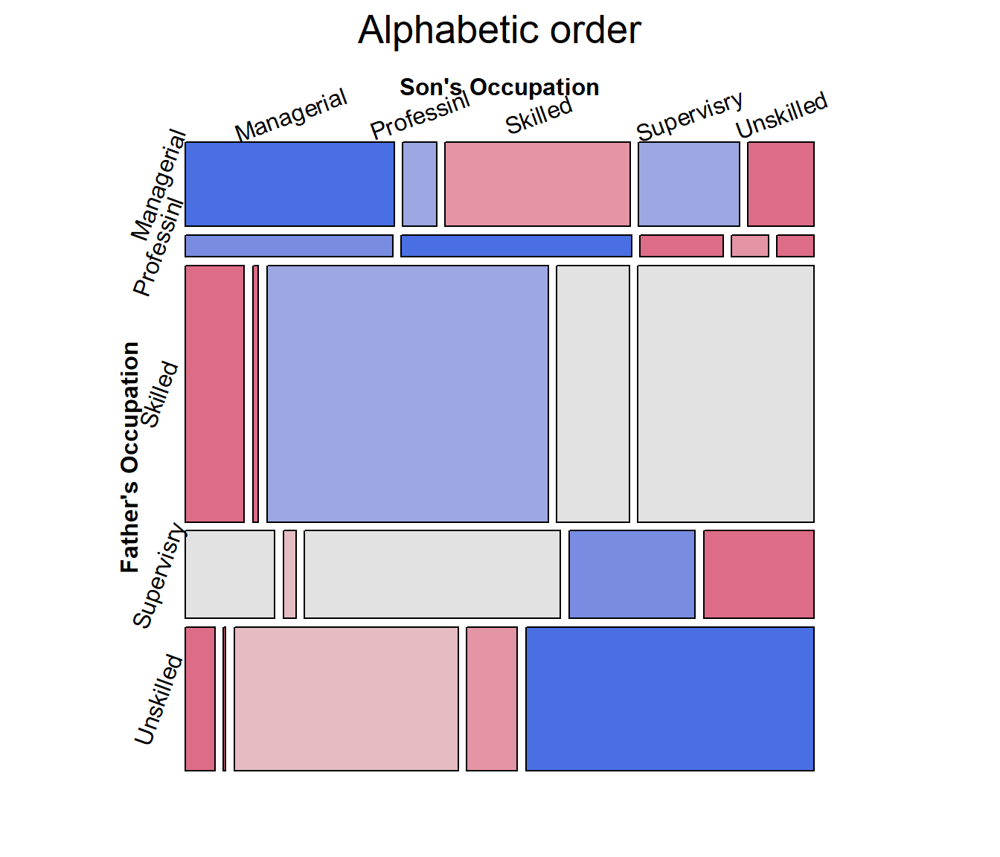
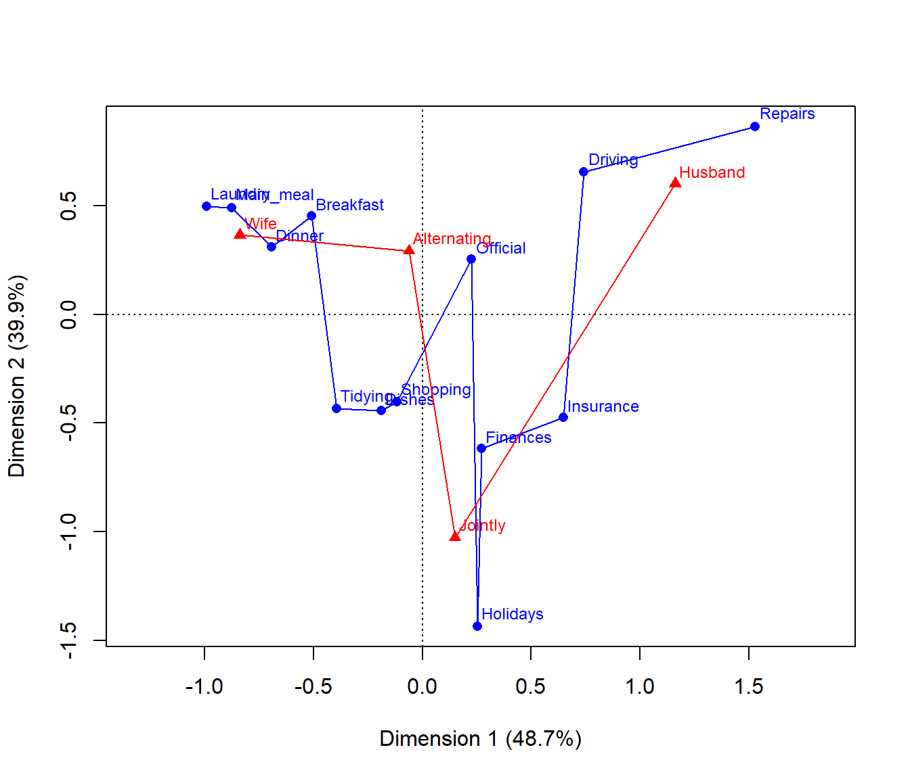

# 4. Mosaic plots

Mosaic plots provide an ideal method both for visualizing contingency
tables and for visualizing the fit— or more importantly— **lack of fit**
of a loglinear model.

For a two-way table,
[`mosaic()`](https://rdrr.io/pkg/vcd/man/mosaic.html), by default, fits
a model of independence, $\lbrack A\rbrack\lbrack B\rbrack$ or `~A + B`
as an R formula. The `vcdExtra` package extends this to models fit using
`glm(..., family=poisson)`, which can include specialized models for
ordered factors, or square tables that are intermediate between the
saturated model, $\lbrack AB\rbrack$ = `A * B`, and the independence
model $\lbrack A\rbrack\lbrack B\rbrack$.

For $n$-way tables,
[`vcd::mosaic()`](https://rdrr.io/pkg/vcd/man/mosaic.html) can fit any
loglinear model, and can also be used to plot a model fit with
`MASS:loglm()`. The `vcdExtra` package extends this to models fit using
[`stats::glm()`](https://rdrr.io/r/stats/glm.html) and, by extension, to
non-linear models fit using the [gnm
package](https://cran.r-project.org/package=gnm).

See Friendly (1994), Friendly (1999) for the statistical ideas behind
these uses of mosaic displays in connection with loglinear models. Our
book Friendly & Meyer (2016) gives a detailed discussion of mosaic plots
and many more examples.

The essential ideas are to:

- recursively sub-divide a unit square into rectangular “tiles” for the
  cells of the table, such that the area of each tile is proportional to
  the cell frequency. Tiles are split in a sequential order:

  - First according to the **marginal** proportions of a first variable,
    V1
  - Next according to the **conditional** proportions of a 2nd variable,
    V2 \| V1
  - Next according to the **conditional** proportions of a 3rd variable,
    V3 \| {V1, V2}
  - …

- For a given loglinear model, the tiles can then be shaded in various
  ways to reflect the residuals (lack of fit) for a given model.

- The pattern of residuals can then be used to suggest a better model or
  understand *where* a given model fits or does not fit.

[`mosaic()`](https://rdrr.io/pkg/vcd/man/mosaic.html) provides a wide
range of options for the directions of splitting, the specification of
shading, labeling, spacing, legend and many other details. It is
actually implemented as a special case of a more general class of
displays for $n$-way tables called `strucplot`, including sieve
diagrams, association plots, double-decker plots as well as mosaic
plots.

For details, see
[`help(strucplot)`](https://rdrr.io/pkg/vcd/man/strucplot.html) and the
“See also” links therein, and also Meyer, Zeileis, & Hornik (2006),
which is available as an R vignette via
[`vignette("strucplot", package="vcd")`](https://cran.rstudio.com/web/packages/vcd/vignettes/strucplot.pdf).

***Example***: A mosaic plot for the Arthritis treatment data fits the
model of independence, `~ Treatment + Improved` and displays the
association in the pattern of residual shading. The goal is to visualize
the difference in the proportions of `Improved` for the two levels of
`Treatment` : “Placebo” and “Treated”.

The plot below is produced with the following call to
[`mosaic()`](https://rdrr.io/pkg/vcd/man/mosaic.html). With the first
split by `Treatment` and the shading used, it is easy to see that more
people given the placebo experienced no improvement, while more people
given the active treatment reported marked improvement.

``` r
data(Arthritis, package="vcd")
art <- xtabs(~Treatment + Improved, data = Arthritis)
mosaic(art, gp = shading_max, 
            split_vertical = TRUE, 
            main="Arthritis: [Treatment] [Improved]")
```


Mosaic plot for the `Arthritis` data, using `shading_max`

`gp = shading_max` specifies that color in the plot signals a
significant residual at a 90% or 99% significance level, with the more
intense shade for 99%. Note that the residuals for the independence
model were not large (as shown in the legend), yet the association
between `Treatment` and `Improved` is highly significant.

``` r
summary(art)
## Call: xtabs(formula = ~Treatment + Improved, data = Arthritis)
## Number of cases in table: 84 
## Number of factors: 2 
## Test for independence of all factors:
##  Chisq = 13.055, df = 2, p-value = 0.001463
```

In contrast, one of the other shading schemes, from Friendly (1994)
(use: `gp = shading_Friendly`), uses fixed cutoffs of $\pm 2, \pm 4$, to
shade cells which are *individually* significant at approximately
$\alpha = 0.05$ and $\alpha = 0.001$ levels, respectively. The plot
below uses `gp = shading_Friendly`.

``` r
mosaic(art, gp = shading_Friendly, 
            split_vertical = TRUE, 
            main="Arthritis: gp = shading_Friendly")
```


Mosaic plot for the `Arthritis` data, using `shading_Friendly`

## Permuting variable levels

Mosaic plots using tables or frequency data frames as input typically
take the levels of the table variables in the order presented in the
dataset. For character variables, this is often alphabetical order. That
might be helpful for looking up a value, but is unhelpful for seeing and
understanding the pattern of association.

It is usually much better to order the levels of the row and column
variables to help reveal the nature of their association. This is an
example of **effect ordering for data display** (Friendly & Kwan, 2003).

***Example***:

Data from Glass (1954) gave this 5 x 5 table on the occupations of 3500
British fathers and their sons, where the occupational categories are
listed in alphabetic order.

``` r
data(Glass, package="vcdExtra")
(glass.tab <- xtabs(Freq ~ father + son, data=Glass))
##               son
## father         Managerial Professional Skilled Supervisory Unskilled
##   Managerial          174           28     154          84        55
##   Professional         45           50      18           8         8
##   Skilled             150           14     714         185       447
##   Supervisory          78           11     223         110        96
##   Unskilled            42            3     320          72       411
```

The mosaic display shows very strong association, but aside from the
diagonal cells, the pattern is unclear. Note the use of `set_varnames`
to give more descriptive labels for the variables and abbreviate the
occupational category labels. and `interpolate` to set the shading
levels for the mosaic.

``` r
largs <- list(set_varnames=list(father="Father's Occupation", 
                                son="Son's Occupation"),
              abbreviate=10)
gargs <- list(interpolate=c(1,2,4,8))

mosaic(glass.tab, 
  shade=TRUE, 
  labeling_args=largs, 
  gp_args=gargs,
  main="Alphabetic order", 
  legend=FALSE, 
  rot_labels=c(20,90,0,70))
```



The occupational categories differ in **status**, and can be reordered
correctly as follows, from `Professional` down to `Unskilled`.

``` r
# reorder by status
ord <- c(2, 1, 4, 3, 5) 
row.names(glass.tab)[ord]
## [1] "Professional" "Managerial"   "Supervisory"  "Skilled"      "Unskilled"
```

The revised mosaic plot can be produced by indexing the rows and columns
of the table using `ord`.

``` r
mosaic(glass.tab[ord, ord], 
  shade=TRUE, 
  labeling_args=largs,  
  gp_args=gargs,
  main="Effect order", 
  legend=FALSE, 
  rot_labels=c(20,90,0,70))
```


From this, and for the examples in the next section, it is useful to
re-define `father` and `son` as **ordered** factors in the original
`Glass` frequency data.frame.

``` r
Glass.ord <- Glass
Glass.ord$father <- ordered(Glass.ord$father, levels=levels(Glass$father)[ord])
Glass.ord$son    <- ordered(Glass.ord$son,    levels=levels(Glass$son)[ord])
str(Glass.ord)
## 'data.frame':    25 obs. of  3 variables:
##  $ father: Ord.factor w/ 5 levels "Professional"<..: 1 1 1 1 1 2 2 2 2 2 ...
##  $ son   : Ord.factor w/ 5 levels "Professional"<..: 1 2 3 4 5 1 2 3 4 5 ...
##  $ Freq  : int  50 45 8 18 8 28 174 84 154 55 ...
```

## Square tables

For mobility tables such as this, where the rows and columns refer to
the same occupational categories it comes as no surprise that there is a
strong association in the diagonal cells: most often, sons remain in the
same occupational categories as their fathers.

However, the re-ordered mosaic display also reveals something subtler:
when a son differs in occupation from the father, it is more likely that
he will appear in a category one-step removed than more steps removed.
The residuals seem to decrease with the number of steps from the
diagonal.

For such tables, specialized loglinear models provide interesting cases
intermediate between the independence model, \[A\] \[B\], and the
saturated model, \[A B\]. These can be fit using
[`glm()`](https://rdrr.io/r/stats/glm.html), with the data in frequency
form,

    glm(Freq ~ A + B + assoc, data = ..., family = poisson)

where `assoc` is a special term to handle a restricted form of
association, different from `A:B` which specifies the saturated model in
this notation.

- **Quasi-independence**: Asserts independence, but ignores the diagonal
  cells by fitting them exactly. The loglinear model is:
  $\log m_{ij} = \mu + \lambda_{i}^{A} + \lambda_{j}^{B} + \delta_{i}I(i = j)$,
  where $I{()}$ is the indicator function.

- **Symmetry**: This model asserts that the joint distribution of the
  row and column variables is symmetric, that is $\pi_{ij} = \pi_{ji}$:
  A son is equally likely to move from their father’s occupational
  category $i$ to another category, $j$, as the reverse, moving from $j$
  to $i$. Symmetry is quite strong, because it also implies **marginal
  homogeneity**, that the marginal probabilities of the row and column
  variables are equal,
  $\pi{i +} = \sum_{j}\pi_{ij} = \sum_{j}\pi_{ji} = \pi_{+ i}$ for all
  $i$.

- **Quasi-symmetry**: This model uses the standard main-effect terms in
  the loglinear model, but asserts that the association parameters are
  symmetric,
  $\log m_{ij} = \mu + \lambda_{i}^{A} + \lambda_{j}^{B} + \lambda_{ij}^{AB}$,
  where $\lambda_{ij}^{AB} = \lambda_{ji}^{AB}$.

The [gnm package](https://cran.r-project.org/package=gnm) provides a
variety of these functions:
[`gnm::Diag()`](https://rdrr.io/pkg/gnm/man/Diag.html),
[`gnm::Symm()`](https://rdrr.io/pkg/gnm/man/Symm.html) and
[`gnm::Topo()`](https://rdrr.io/pkg/gnm/man/Topo.html) for an
interaction factor as specified by an array of levels, which may be
arbitrarily structured.

For example, the following generates a term for a diagonal factor in a
$4 \times 4$ table. The diagonal values reflect parameters fitted for
each diagonal cell. Off-diagonal values, “.” are ignored.

``` r
rowfac <- gl(4, 4, 16)
colfac <- gl(4, 1, 16)
diag4by4 <- Diag(rowfac, colfac)
matrix(Diag(rowfac, colfac, binary = FALSE), 4, 4)
##      [,1] [,2] [,3] [,4]
## [1,] "1"  "."  "."  "." 
## [2,] "."  "2"  "."  "." 
## [3,] "."  "."  "3"  "." 
## [4,] "."  "."  "."  "4"
```

[`Symm()`](https://rdrr.io/pkg/gnm/man/Symm.html) constructs parameters
for symmetric cells. The particular values don’t matter. All that does
matter is that the same value, e.g., `1:2` appears in both the (1,2) and
(2,1) cells.

``` r
symm4by4 <- Symm(rowfac, colfac)
matrix(symm4by4, 4, 4)
##      [,1]  [,2]  [,3]  [,4] 
## [1,] "1:1" "1:2" "1:3" "1:4"
## [2,] "1:2" "2:2" "2:3" "2:4"
## [3,] "1:3" "2:3" "3:3" "3:4"
## [4,] "1:4" "2:4" "3:4" "4:4"
```

***Example***: To illustrate, we fit the four models below, starting
with the independence model `Freq ~ father + son` and then adding terms
to reflect the restricted forms of association, e.g.,
`Diag(father, son)` for diagonal terms and `Symm(father, son)` for
symmetry.

``` r
library(gnm)
glass.indep <- glm(Freq ~ father + son, 
                   data = Glass.ord, family=poisson)
glass.quasi <- glm(Freq ~ father + son + Diag(father, son),  
                   data = Glass.ord, family=poisson)
glass.symm  <- glm(Freq ~ Symm(father, son),  
                   data = Glass.ord, family=poisson)
glass.qsymm <- glm(Freq ~ father + son + Symm(father, son),  
                   data = Glass.ord, family=poisson)
```

We can visualize these using the
[`vcdExtra::mosaic.glm()`](https://friendly.github.io/vcdExtra/reference/mosaic.glm.md)
method, which extends mosaic displays to handle fitted `glm` objects.
*Technical note*: for models fitted using
[`glm()`](https://rdrr.io/r/stats/glm.html), standardized residuals,
`residuals_type="rstandard"` have better statistical properties than the
default Pearson residuals in mosaic plots and analysis.

``` r
mosaic(glass.quasi, 
  residuals_type="rstandard", 
  shade=TRUE, 
  labeling_args=largs,  
  gp_args=gargs,
  main="Quasi-Independence",
  legend=FALSE, 
  rot_labels=c(20,90,0,70)
  )
```


Mosaic plots for the other models would give further visual assessment
of these models, however we can also test differences among them. For
nested models, [`anova()`](https://rdrr.io/r/stats/anova.html) gives
tests of how much better a more complex model is compared to the
previous one.

``` r
# model comparisons: for *nested* models
anova(glass.indep, glass.quasi, glass.qsymm, test="Chisq")
## Analysis of Deviance Table
## 
## Model 1: Freq ~ father + son
## Model 2: Freq ~ father + son + Diag(father, son)
## Model 3: Freq ~ father + son + Symm(father, son)
##   Resid. Df Resid. Dev Df Deviance  Pr(>Chi)    
## 1        16     792.19                          
## 2        11     235.78  5   556.41 < 2.2e-16 ***
## 3         6       4.66  5   231.12 < 2.2e-16 ***
## ---
## Signif. codes:  0 '***' 0.001 '**' 0.01 '*' 0.05 '.' 0.1 ' ' 1
```

Alternatively,
[`vcdExtra::LRstats()`](https://friendly.github.io/vcdExtra/reference/LRstats.md)
gives model summaries for a collection of models, not necessarily
nested, with AIC and BIC statistics reflecting model parsimony.

``` r
models <- glmlist(glass.indep, glass.quasi, glass.symm, glass.qsymm)
LRstats(models)
## Likelihood summary table:
##                AIC    BIC LR Chisq Df Pr(>Chisq)    
## glass.indep 960.91 971.88   792.19 16  < 2.2e-16 ***
## glass.quasi 414.50 431.57   235.78 11  < 2.2e-16 ***
## glass.symm  218.18 236.47    37.46 10  4.704e-05 ***
## glass.qsymm 193.38 216.54     4.66  6     0.5876    
## ---
## Signif. codes:  0 '***' 0.001 '**' 0.01 '*' 0.05 '.' 0.1 ' ' 1
```

By all criteria, the model of quasi symmetry fits best. The residual
deviance \$G^2 is not significant. The mosaic is largely unshaded,
indicating a good fit, but there are a few shaded cells that indicate
the remaining positive and negative residuals. For comparative mosaic
displays, it is sometimes useful to show the $G^{2}$ statistic in the
main title, using
[`vcdExtra::modFit()`](https://friendly.github.io/vcdExtra/reference/modFit.md)
for this purpose.

``` r
mosaic(glass.qsymm, 
  residuals_type="rstandard", 
  shade=TRUE, 
  labeling_args=largs,  
  gp_args=gargs,
  main = paste("Quasi-Symmetry", modFit(glass.qsymm)),
  legend=FALSE, 
  rot_labels=c(20,90,0,70)
  )
```


## Correspondence analysis ordering

When natural orders for row and column levels are not given a priori, we
can find orderings that make more sense using correspondence analysis.

The general ideas are that:

- Correspondence analysis assigns scores to the row and column variables
  to best account for the association in 1, 2, … dimensions

- The first CA dimension accounts for largest proportion of the Pearson
  $\chi^{2}$

- Therefore, permuting the levels of the row and column variables by the
  CA Dim1 scores gives a more coherent mosaic plot, more clearly showing
  the nature of the association.

- The [seriation package](https://cran.r-project.org/package=seriation)
  now has a method to order variables in frequency tables using CA.

***Example***: As an example, consider the `HouseTasks` dataset, a 13 x
4 table of frequencies of household tasks performed by couples, either
by the `Husband`, `Wife`, `Alternating` or `Jointly`. You can see from
the table that some tasks (Repairs) are done largely by the husband;
some (laundry, main meal) are largely done by the wife, while others are
done jointly or alternating between husband and wife. But the `Task` and
`Who` levels are both in alphabetical order.

``` r
data("HouseTasks", package = "vcdExtra")
HouseTasks
##            Who
## Task        Alternating Husband Jointly Wife
##   Breakfast          36      15       7   82
##   Dinner             11       7      13   77
##   Dishes             24       4      53   32
##   Driving            51      75       3   10
##   Finances           13      21      66   13
##   Holidays            1       6     153    0
##   Insurance           1      53      77    8
##   Laundry            14       2       4  156
##   Main_meal          20       5       4  124
##   Official           46      23      15   12
##   Repairs             3     160       2    0
##   Shopping           23       9      55   33
##   Tidying            11       1      57   53
```

The naive mosaic plot for this dataset is shown below, splitting first
by `Task` and then by `Who`. Due to the length of the factor labels,
some features of `labeling` were used to make the display more readable.

``` r
require(vcd)
mosaic(HouseTasks, shade = TRUE,
       labeling = labeling_border(rot_labels = c(45,0, 0, 0), 
                                  offset_label =c(.5,5,0, 0),
                                  varnames = c(FALSE, TRUE),
                                  just_labels=c("center","right"),
                                  tl_varnames = FALSE),
       legend = FALSE)
```


Correspondence analysis, using the [ca
package](https://cran.r-project.org/package=ca), shows that nearly 89%
of the $\chi^{2}$ can be accounted for in two dimensions.

``` r
require(ca)
## Loading required package: ca
HT.ca <- ca(HouseTasks)
summary(HT.ca, rows=FALSE, columns=FALSE)
## 
## Principal inertias (eigenvalues):
## 
##  dim    value      %   cum%   scree plot               
##  1      0.542889  48.7  48.7  ************             
##  2      0.445003  39.9  88.6  **********               
##  3      0.127048  11.4 100.0  ***                      
##         -------- -----                                 
##  Total: 1.114940 100.0
```

The CA plot has a fairly simple interpretation: Dim1 is largely the
distinction between tasks primarily done by the wife vs. the husband.
Dim2 distinguishes tasks that are done singly vs. those that are done
jointly.

``` r
plot(HT.ca, lines = TRUE)
```



So, we can use the `CA` method of
[`seriation::seriate()`](https://rdrr.io/pkg/seriation/man/seriate.html)
to find the order of permutations of `Task` and `Who` along the CA
dimensions.

``` r
require(seriation)
order <- seriate(HouseTasks, method = "CA")
# the permuted row and column labels
rownames(HouseTasks)[order[[1]]]
##  [1] "Laundry"   "Main_meal" "Dinner"    "Breakfast" "Tidying"   "Dishes"   
##  [7] "Shopping"  "Official"  "Holidays"  "Finances"  "Insurance" "Driving"  
## [13] "Repairs"
colnames(HouseTasks)[order[[2]]]
## [1] "Wife"        "Alternating" "Jointly"     "Husband"
```

Now, use
[`seriation::permute()`](https://rdrr.io/pkg/seriation/man/permute.html)
to use `order` for the permutations of `Task` and `Who`, and plot the
resulting mosaic:

``` r
# do the permutation
HT_perm <- permute(HouseTasks, order, margin=1)

mosaic(HT_perm, shade = TRUE,
       labeling = labeling_border(rot_labels = c(45,0, 0, 0), 
                                  offset_label =c(.5,5,0, 0),
                                  varnames = c(FALSE, TRUE),
                                  just_labels=c("center","right"),
                                  tl_varnames = FALSE),
       legend = FALSE)
```


It is now easy to see the cluster of tasks (laundry and cooking) done
largely by the wife at the top, and those (repairs, driving) done
largely by the husband at the bottom.

## References

Friendly, M. (1994). Mosaic displays for multi-way contingency tables.
*Journal of the American Statistical Association*, *89*, 190–200.

Friendly, M. (1999). Extending mosaic displays: Marginal, conditional,
and partial views of categorical data. *Journal of Computational and
Graphical Statistics*, *8*(3), 373–395.

Friendly, M., & Kwan, E. (2003). Effect ordering for data displays.
*Computational Statistics and Data Analysis*, *43*(4), 509–539.
Retrieved from
<http://authors.elsevier.com/sd/article/S0167947302002906>

Friendly, M., & Meyer, D. (2016). *Discrete data analysis with R:
Visualization and modeling techniques for categorical and count data*.
Boca Raton, FL: Chapman & Hall/CRC.

Glass, D. V. (1954). *Social mobility in britain*. Glencoe, IL: The Free
Press.

Meyer, D., Zeileis, A., & Hornik, K. (2006). The strucplot framework:
Visualizing multi-way contingency tables with. *Journal of Statistical
Software*, *17*(3), 1–48. Retrieved from
<https://www.jstatsoft.org/v17/i03/>
