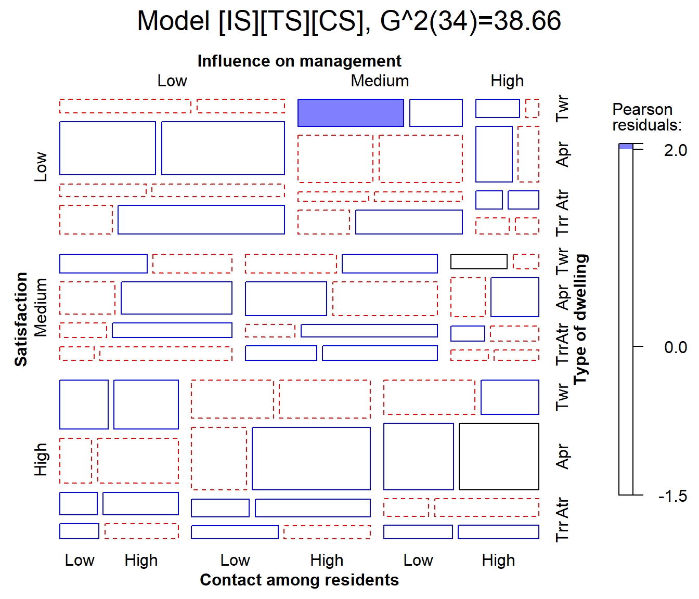

# 5. Demo - Housing Data

This vignette was one of a series of
[`demo()`](https://rdrr.io/r/utils/demo.html) files in the package. It
is still there as `demo("housing")`, but is now presented here with
additional commentary and analysis, designed to highlight some aspects
of analysis of categorical data and graphical display.

## Load packages

I’ll use the following packages in this vignette.

``` r
library(vcdExtra)
library(MASS)
library(effects)
```

## Housing data

The content here is the dataset
[`MASS::housing`](https://rdrr.io/pkg/MASS/man/housing.html), giving a
4-way, $`3 \times 3 \times 4 \times 2`$ frequency table of 1681
individuals from the *Copenhagen Housing Conditions Survey*, classified
by their:

- Satisfaction (`Sat`) with their housing circumstances (low, medium or
  high),
- `Type` of rental dwelling (Tower, Apartment, Atrium or Terrace)
- perceived influence (`Infl`) on management of the property (low,
  medium, high), and
- degree of contact (`Cont`) with other residents (low or high)

Load the data:

``` r
data(housing, package="MASS")
str(housing)
## 'data.frame':    72 obs. of  5 variables:
##  $ Sat : Ord.factor w/ 3 levels "Low"<"Medium"<..: 1 2 3 1 2 3 1 2 3 1 ...
##  $ Infl: Factor w/ 3 levels "Low","Medium",..: 1 1 1 2 2 2 3 3 3 1 ...
##  $ Type: Factor w/ 4 levels "Tower","Apartment",..: 1 1 1 1 1 1 1 1 1 2 ...
##  $ Cont: Factor w/ 2 levels "Low","High": 1 1 1 1 1 1 1 1 1 1 ...
##  $ Freq: int  21 21 28 34 22 36 10 11 36 61 ...
```

### Variables, levels and models

Satisfaction (`Sat`) of these householders with their present housing
circumstances is the **outcome variable** here.

For purposes of analysis, note that `Sat` is an ordered factor with
levels `"Low" < "Medium" < "High"`.

Note also that Influence, with the same levels is just a “Factor”, not
an ordered one.

I consider here just models using `glm(..., family=poisson)` or the
equivalent in
[`MASS::loglm()`](https://rdrr.io/pkg/MASS/man/loglm.html).

The ordering of factor levels is important in graphical displays. We
don’t want to see them ordered alphabetically, “High”, “Low”, “Medium”.
The `housing` data.frame was constructed so that the levels of `Sat` and
`Infl` appear in the dataset in their appropriate order.

``` r
levels(housing$Sat)
## [1] "Low"    "Medium" "High"
levels(housing$Infl)
## [1] "Low"    "Medium" "High"
```

Other models, e.g., the **proportional odds** model, fit using
`MASS:polr()` can take the ordinal nature of satisfaction into account.
In [`glm()`](https://rdrr.io/r/stats/glm.html) one could re-assign
`Infl` as an ordered factor and examine linear vs. non-linear
associations for this factor. But I don’t do this here.

## Null model

The most ignorant model asserts that all the table factors are mutually
independent. In symbolic notation, this is `[S] [I] [T] [C]` where all
terms in separate `[ ]` are supposed to be independent. This is
`Freq ~ Sat + Infl + Type + Cont` as a formula for
[`glm()`](https://rdrr.io/r/stats/glm.html).

``` r
house.null <- glm(Freq ~ Sat + Infl + Type + Cont, family = poisson,
                  data = housing)
```

## Baseline model

When `Sat` is the outcome variable, a minimal **baseline model** should
allow for all associations among the predictors, symbolized as
`[S] [I T C]`. That is, Influence, Type and Contact may be associated in
arbitrary ways, just as multiple predictors can be correlated in
regression models.

In this framework, what remains to be explained is whether/how `Sat`
depends on the combinations of the other variables. The baseline model
therefore includes the full three-way term for the predictors.

``` r
house.glm0 <- glm(Freq ~ Sat + Infl*Type*Cont, family = poisson,
                  data = housing)
```

Both of these models fit terribly, but we can always use
`anova(mod1, mod2,...)` to compare the *relative* fits of **nested**
models.

``` r
anova(house.null, house.glm0, test = "Chisq")
## Analysis of Deviance Table
## 
## Model 1: Freq ~ Sat + Infl + Type + Cont
## Model 2: Freq ~ Sat + Infl * Type * Cont
##   Resid. Df Resid. Dev Df Deviance  Pr(>Chi)    
## 1        63     295.35                          
## 2        46     217.46 17   77.896 9.045e-10 ***
## ---
## Signif. codes:  0 '***' 0.001 '**' 0.01 '*' 0.05 '.' 0.1 ' ' 1
```

## Visualising model fit

The baseline model is shown in the mosaic plot below. Note that this is
applied not to the `housing` data, but rather to the `house.glm0` object
(of class `glm`) resulting to a call to
[`vcdExtra::mosaic.glm()`](https://friendly.github.io/vcdExtra/reference/mosaic.glm.md).

With four variables in the mosaic, labeling of the variable names and
factor levels is a bit tricky, because labels must appear on all four
sides of the plot. The `labeling_args` argument can be used to set more
informative variable names and abbreviate factor levels where necessary.

``` r
# labeling_args for mosaic()
largs <- list(set_varnames = c(
      Infl="Influence on management", 
            Cont="Contact among residents", 
            Type="Type of dwelling", 
            Sat="Satisfaction"),
    abbreviate=c(Type=3))

mosaic(house.glm0, 
       labeling_args=largs, 
       main='Baseline model: [ITC][Sat]')
## Warning: no formula provided, assuming ~Sat + Infl + Type + Cont
```


In this plot we can see largish positive residuals in the blocks
corresponding to (low satisfaction, low influence) and (high
satisfaction, high influence) and clusters of largish negative residuals
in the opposite corners.

By default, variables are used in the mosaic display in their order in
the data table or frequency data.frame. The warning reminds us that the
order of conditioning used is `~Sat + Infl + Type + Cont`.

### Ordering the variables in the mosaic

For
[`mosaic.glm()`](https://friendly.github.io/vcdExtra/reference/mosaic.glm.md),
the conditioning order of variables in the mosaic can be set using the
`formula` argument. Here, I rearrange the variables to put `Sat` as the
last variable in the splitting / conditioning sequence. I also use
[`vcdExtra::modFit()`](https://friendly.github.io/vcdExtra/reference/modFit.md)
to add the LR $`G^2`$ fit statistic to the plot title.

``` r
mosaic(house.glm0, 
       formula = ~ Type + Infl + Cont + Sat, 
       labeling_args=largs, 
       main=paste('Baseline model: [ITC][Sat],', modFit(house.glm0))
  )
```


## Adding association terms

Clearly, satisfaction depends on one or more of the predictors, `Infl`,
`Type` and `Cont` and possibly their interactions.

As a first step it is useful to consider sequentially adding the
association terms `Infl:Sat`, `Type:Sat`, `Cont:Sat` one at a time. This
analysis is carried out using
[`MASS::addterm()`](https://rdrr.io/pkg/MASS/man/addterm.html).

``` r
MASS::addterm(house.glm0, 
              ~ . + Sat:(Infl + Type + Cont), 
              test = "Chisq")
## Single term additions
## 
## Model:
## Freq ~ Sat + Infl * Type * Cont
##          Df Deviance    AIC     LRT   Pr(Chi)    
## <none>        217.46 610.43                      
## Sat:Infl  4   111.08 512.05 106.371 < 2.2e-16 ***
## Sat:Type  6   156.79 561.76  60.669 3.292e-11 ***
## Sat:Cont  2   212.33 609.30   5.126   0.07708 .  
## ---
## Signif. codes:  0 '***' 0.001 '**' 0.01 '*' 0.05 '.' 0.1 ' ' 1
```

Based on this, it is useful to consider a “main-effects” model for
satisfaction, adding all three two-way terms involving satisfaction.

The [`update()`](https://rdrr.io/r/stats/update.html) method provides an
easy way to add (or subtract) terms from a fitted model object. In the
model formula, `.` stands for whatever was on the left side (`Freq`) or
on the right side (`Sat + Infl*Type*Cont`) of the model (`house.glm0`)
that is being updated.

``` r
house.glm1 <- update(house.glm0, 
                     . ~ . + Sat*(Infl + Type + Cont))
```

For comparison, we note that the same model can be fit using the
iterative proportional scaling algorithm of
[`MASS::loglm()`](https://rdrr.io/pkg/MASS/man/loglm.html).

``` r
(house.loglm1 <- MASS::loglm(Freq ~ Infl * Type * Cont + 
                              Sat*(Infl + Type + Cont), data = housing))
## Call:
## MASS::loglm(formula = Freq ~ Infl * Type * Cont + Sat * (Infl + 
##     Type + Cont), data = housing)
## 
## Statistics:
##                       X^2 df  P(> X^2)
## Likelihood Ratio 38.66222 34 0.2671359
## Pearson          38.90831 34 0.2582333
```

## Did the model get better?

As before, [`anova()`](https://rdrr.io/r/stats/anova.html) tests the
added contribution of each more complex model over the one before. The
residual deviance $`G^2`$ has been reduced from $`G^2 (46) = 217.46`$
for the baseline model `house.glm0` to $`G^2 (34) = 38.66`$ for the
revised model `house.glm1`. The difference,
$`G^2(M1 | M0) = G^2 (12) = 178.79`$ tests the collective additional fit
provided by the two-way association of satisfaction with the predictors.

``` r
anova(house.glm0, house.glm1, test="Chisq")
## Analysis of Deviance Table
## 
## Model 1: Freq ~ Sat + Infl * Type * Cont
## Model 2: Freq ~ Sat + Infl + Type + Cont + Infl:Type + Infl:Cont + Type:Cont + 
##     Sat:Infl + Sat:Type + Sat:Cont + Infl:Type:Cont
##   Resid. Df Resid. Dev Df Deviance  Pr(>Chi)    
## 1        46    217.456                          
## 2        34     38.662 12   178.79 < 2.2e-16 ***
## ---
## Signif. codes:  0 '***' 0.001 '**' 0.01 '*' 0.05 '.' 0.1 ' ' 1
```

## Visualize model `glm1`

The model `house.glm1` fits reasonably well, G^2(34)=38.66, so most
residuals are small. In the mosaic below, I use `gp=shading_Friendly` to
shade the tiles so that positive and negative residuals are
distinguished by color, and they are filled when the absolute value of
the residual is outside $`\pm 2, 4`$.

``` r
mosaic(house.glm1, 
       labeling_args=largs, 
       main=paste('Model [IS][TS][CS],', modFit(house.glm1) ), 
       gp=shading_Friendly)
```



One cell is highlighted here: The combination of medium influence, low
contact and tower type, is more likely to give low satisfaction than the
model predicts. Is this just an outlier, or is there something that can
be interpreted and perhaps improve the model fit? It is hard tell, but
the virtues of mosaic displays are that they help to:

- diagnose overall patterns of associations,
- spot unusual cells in relation to lack of fit of a given model.

## Can we drop any terms?

When we add terms using
[`MASS::addterm()`](https://rdrr.io/pkg/MASS/man/addterm.html), they are
added sequentially. It might be the case that once some term is added, a
previously added term is no longer important. Running
[`MASS::dropterm()`](https://rdrr.io/pkg/MASS/man/dropterm.html) on the
`housel.glm1` model checks for this.

``` r
MASS::dropterm(house.glm1, test = "Chisq")
## Single term deletions
## 
## Model:
## Freq ~ Sat + Infl + Type + Cont + Infl:Type + Infl:Cont + Type:Cont + 
##     Sat:Infl + Sat:Type + Sat:Cont + Infl:Type:Cont
##                Df Deviance    AIC     LRT   Pr(Chi)    
## <none>              38.662 455.63                      
## Sat:Infl        4  147.780 556.75 109.117 < 2.2e-16 ***
## Sat:Type        6  100.889 505.86  62.227 1.586e-11 ***
## Sat:Cont        2   54.722 467.69  16.060 0.0003256 ***
## Infl:Type:Cont  6   43.952 448.92   5.290 0.5072454    
## ---
## Signif. codes:  0 '***' 0.001 '**' 0.01 '*' 0.05 '.' 0.1 ' ' 1
```

Note that the three-way term `Infl:Type:Cont` is not significant.
However, with `Sat` as the response, the associations of all predictors
must be included in the model.

## What about two-way interactions?

The model so far says that each of influence, type and control have
separate, additive effects on the level of satisfaction, what I called a
“main-effects” model. It might be the case that some of the predictors
have *interaction* effects, e.g., that the effect of influence on
satisfaction might vary with the type of dwelling or the level of
control.

An easy way to test for these is to update the main-effects model,
adding all possible two-way interactions for `Sat`, one at a time, with
[`addterm()`](https://rdrr.io/pkg/MASS/man/addterm.html).

``` r
MASS::addterm(house.glm1,
               ~. + Sat:(Infl + Type + Cont)^2, 
              test  =  "Chisq")
## Single term additions
## 
## Model:
## Freq ~ Sat + Infl + Type + Cont + Infl:Type + Infl:Cont + Type:Cont + 
##     Sat:Infl + Sat:Type + Sat:Cont + Infl:Type:Cont
##               Df Deviance    AIC     LRT Pr(Chi)  
## <none>             38.662 455.63                  
## Sat:Infl:Type 12   16.107 457.08 22.5550 0.03175 *
## Sat:Infl:Cont  4   37.472 462.44  1.1901 0.87973  
## Sat:Type:Cont  6   28.256 457.23 10.4064 0.10855  
## ---
## Signif. codes:  0 '***' 0.001 '**' 0.01 '*' 0.05 '.' 0.1 ' ' 1
```

The result shows that adding the term `Infl:Type:Sat` reduces the
deviance $`G^2`$ from 38.66 to 16.11. The difference,
$`G^2(M1 + ITS | M1) = G^2 (12) = 22.55`$ reflects a substantial
improvement. The remaining two-way interaction terms reduce the deviance
by smaller and non-significant amounts, relative to `house.glm1`.

Model fitting should be guided by substance, not just statistical
machinery. Nonetheless, it seems arguably sensible to add one two-way
term to the model, giving `house.glm2`.

``` r
house.glm2 <- update(house.glm1,
                     . ~ . + Sat:Infl:Type)
```

## Model parsimony: AIC & BIC

Adding more association terms to a model will always improve it. The
question is, whether that is “worth it”?

“Worth it” concerns the trade-off between model fit and parsimony.
Sometimes we might prefer a model with fewer parameters to one that has
a slightly better fit, but requires more model terms and parameters.

The AIC and BIC statistics are designed to adjust our assessment of
model fit by penalizing it for using more parameters. Equivalently, they
deduct from the likelihood ratio $`G^2`$ a term proportional to the
residual $`\text{df}`$ of the model. In any case – **smaller is better**
for both AIC and BIC.

``` math
AIC = G^2 - 2 \: \text{df}
```
``` math
BIC = G^2 - \log(n) \: \text{df}
```

These measures are provided by
[`AIC()`](https://rdrr.io/r/stats/AIC.html),
[`BIC()`](https://rdrr.io/r/stats/AIC.html), and can be used to compare
models using
[`vcdExtra::LRstats()`](https://friendly.github.io/vcdExtra/reference/LRstats.md).

``` r
LRstats(house.glm0, house.glm1, house.glm2)
## Likelihood summary table:
##               AIC    BIC LR Chisq Df Pr(>Chisq)    
## house.glm0 610.43 669.62  217.456 46     <2e-16 ***
## house.glm1 455.63 542.15   38.662 34     0.2671    
## house.glm2 457.08 570.91   16.107 22     0.8105    
## ---
## Signif. codes:  0 '***' 0.001 '**' 0.01 '*' 0.05 '.' 0.1 ' ' 1
```

By these metrics, model `house.glm1` is best on both AIC and BIC. The
increased goodness-of-fit (smaller $`G^2`$) of model `house.glm2` is not
worth the extra cost of parameters in the `house.glm2` model.
