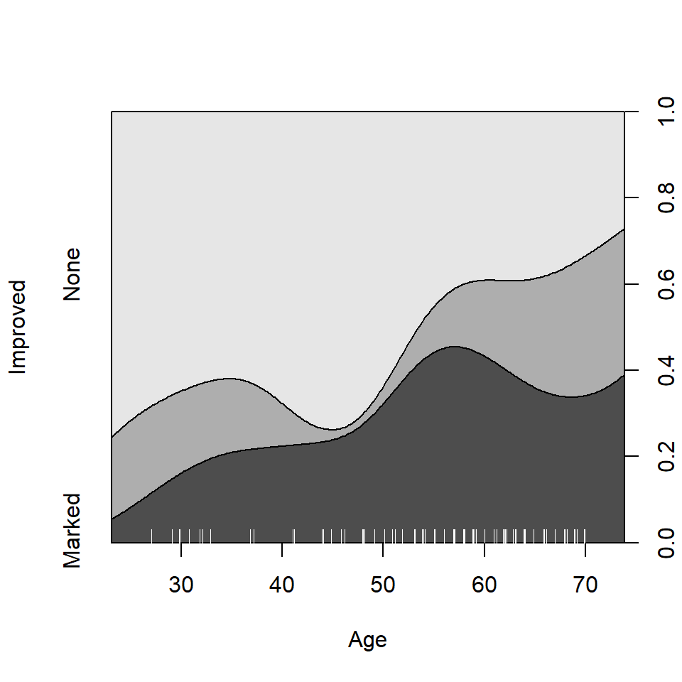

# 7. Continuous predictors

When continuous predictors are available—and potentially important—in
explaining a categorical outcome, models for that outcome include:
logistic regression (binary response), the proportional odds model
(ordered polytomous response), multinomial (generalized) logistic
regression. Many of these are special cases of the generalized linear
model using the `"poisson"` or `"binomial"` family and their relatives.

### Spine and conditional density plots

I don’t go into fitting such models here, but I would be remiss not to
illustrate some visualizations in `vcd` that are helpful here. The first
of these is the spine plot or spinogram (Hummel, 1996), produced with
[`spine()`](https://rdrr.io/pkg/vcd/man/spine.html). These are special
cases of mosaic plots with specific spacing and shading to show how a
categorical response varies with a continuous or categorical predictor.

They are also a generalization of stacked bar plots where not the
heights but the *widths* of the bars corresponds to the relative
frequencies of `x`. The heights of the bars then correspond to the
conditional relative frequencies of `y` in every `x` group.

***Example***: For the `Arthritis` data, we can see how `Improved`
varies with `Age` as follows.
[`spine()`](https://rdrr.io/pkg/vcd/man/spine.html) takes a formula of
the form `y ~ x` with a single dependent factor and a single explanatory
variable `x` (a numeric variable or a factor). The range of a numeric
variable`x` is divided into intervals based on the `breaks` argument,
and stacked bars are drawn to show the distribution of `y` as `x`
varies. As shown below, the discrete table that is visualized is
returned by the function.

``` r
(spine(Improved ~ Age, data = Arthritis, breaks = 3))
##          Improved
## Age       None Some Marked
##   [20,40]   10    3      2
##   (40,60]   21    3     17
##   (60,80]   11    8      9
(spine(Improved ~ Age, data = Arthritis, breaks = "Scott"))
##          Improved
## Age       None Some Marked
##   [20,30]    6    1      0
##   (30,40]    4    2      2
##   (40,50]    9    0      3
##   (50,60]   12    3     14
##   (60,70]   11    8      8
##   (70,80]    0    0      1
```


Spine plots for the `Arthritis` data

The conditional density plot (Hofmann & Theus, 2005) is a further
generalization. This visualization technique is similar to spinograms,
but uses a smoothing approach rather than discretizing the explanatory
variable. As well, it uses the original `x` axis and not a distorted
one.

``` r
cdplot(Improved ~ Age, data = Arthritis)
```


Conditional density plot for the `Arthritis` data showing the variation
of Improved with Age.

In such plots, it is useful to also see the distribution of the
observations across the horizontal axis, e.g., with a
[`rug()`](https://rdrr.io/r/graphics/rug.html) plot. @ref{fig:cd-plot}
uses [`cdplot()`](https://rdrr.io/r/graphics/cdplot.html) from the
`graphics` package rather than
[`cd_plot()`](https://rdrr.io/pkg/vcd/man/cd_plot.html) from `vcd`, and
is produced with

``` r
cdplot(Improved ~ Age, data = Arthritis)
with(Arthritis, rug(jitter(Age), col="white", quiet=TRUE))
```



From this figure it can be easily seen that the proportion of patients
reporting Some or Marked improvement increases with Age, but there are
some peculiar bumps in the distribution. These may be real or
artifactual, but they would be hard to see with most other visualization
methods. When we switch from non-parametric data exploration to
parametric statistical models, such effects are easily missed.

### Model-based plots: effect plots and `ggplot2 plots`

The nonparametric conditional density plot uses smoothing methods to
convey the distributions of the response variable, but displays that are
simpler to interpret can often be obtained by plotting the predicted
response from a parametric model.

For complex [`glm()`](https://rdrr.io/r/stats/glm.html) models with
interaction effects, the `effects` package provides the most useful
displays, plotting the predicted values for a given term, averaging over
other predictors not included in that term. I don’t illustrate this
here, but see Fox & Weisberg (2018),Fox (2003) and
[`help(package="effects")`](https://rdrr.io/pkg/effects/man).

Here I just briefly illustrate the capabilities of the `ggplot2` package
for model-smoothed plots of categorical responses in
[`glm()`](https://rdrr.io/r/stats/glm.html) models.

***Example***: The `Donner` data frame in `vcdExtra` gives details on
the survival of 90 members of the Donner party, a group of people who
attempted to migrate to California in 1846. They were trapped by an
early blizzard on the eastern side of the Sierra Nevada mountains, and
before they could be rescued, nearly half of the party had died. What
factors affected who lived and who died?

``` r
data(Donner, package="vcdExtra")
str(Donner)
## 'data.frame':    90 obs. of  5 variables:
##  $ family  : Factor w/ 10 levels "Breen","Donner",..: 9 1 1 1 1 1 1 1 1 1 ...
##  $ age     : int  23 13 1 5 14 40 51 9 3 8 ...
##  $ sex     : Factor w/ 2 levels "Female","Male": 2 2 1 2 2 1 2 2 2 2 ...
##  $ survived: int  0 1 1 1 1 1 1 1 1 1 ...
##  $ death   : POSIXct, format: "1846-12-29" NA ...
```

A potential model of interest is the logistic regression model for
$`Pr(survived)`$, allowing separate fits for males and females as a
function of `age`. The key to this is the
[`stat_smooth()`](https://ggplot2.tidyverse.org/reference/geom_smooth.html)
function, using `method = "glm", method.args = list(family = binomial)`.
The `formula = y ~ x` specifies a linear fit on the logit scale
(@ref{fig:donner3}, left)

``` r
# separate linear fits on age for M/F
ggplot(Donner, aes(age, survived, color = sex)) +
  geom_point(position = position_jitter(height = 0.02, width = 0)) +
  stat_smooth(method = "glm", 
              method.args = list(family = binomial), 
              formula = y ~ x,
              alpha = 0.2, size=2, aes(fill = sex))
```

Alternatively, we can allow a quadratic relation with `age` by
specifying `formula = y ~ poly(x,2)` ((**ref?**)(fig:donner3), right).

``` r
# separate quadratics
ggplot(Donner, aes(age, survived, color = sex)) +
  geom_point(position = position_jitter(height = 0.02, width = 0)) +
  stat_smooth(method = "glm", 
              method.args = list(family = binomial), 
              formula = y ~ poly(x,2), 
              alpha = 0.2, size=2, aes(fill = sex))
```


Logistic regression plots for the `Donner` data showing survival
vs. age, by sex. Left: linear logistic model; right: quadratic model
{#fig:donner3}

These plots very nicely show (a) the fitted $`Pr(survived)`$ for males
and females; (b) confidence bands around the smoothed model fits and (c)
the individual observations by jittered points at 0 and 1 for those who
died and survived, respectively.

## References

Fox, J. (2003). Effect displays in R for generalised linear models.
*Journal of Statistical Software*, *8*(15), 1–27.
http://doi.org/[10.18637/jss.v008.i15](https://doi.org/10.18637/jss.v008.i15)

Fox, J., & Weisberg, S. (2018). Visualizing fit and lack of fit in
complex regression models with predictor effect plots and partial
residuals. *Journal of Statistical Software*, *87*(9), 1–27.
http://doi.org/[10.18637/jss.v087.i09](https://doi.org/10.18637/jss.v087.i09)

Hofmann, H., & Theus, M. (2005). *Interactive graphics for visualizing
conditional distributions*.

Hummel, J. (1996). Linked bar charts: Analysing categorical data
graphically. *Computational Statistics*, *11*, 23–33.
