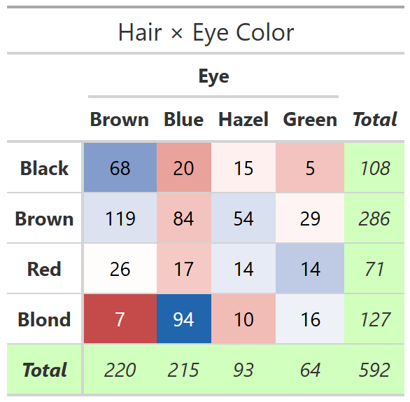

```{r}
#| label: setup
#| include: false
library(vcdExtra)
```

## Overview

`color_table()` produces a `gt` table object with cell backgrounds shaded by
observed frequencies or Pearson residuals from an independence model.

**Rendering in Quarto documents:**

| Format | Strategy |
|--------|----------|
| HTML   | Return the `gt` object — renders natively via gt's `knit_print` |
| PDF    | `gt` can render to LaTeX/PDF via `gt::as_latex()`, but the easiest cross-format path is `filename = "…png"` + `knitr::include_graphics()`. Supported formats: `.png`, `.pdf`, `.html`, `.rtf`, `.docx` (not `.svg`) |
| Word   | Same save-as-image approach |

---

## HTML output — return the gt object directly

For HTML output no `filename` argument is needed.

```{r}
#| label: html-basic
data(HairEyeColor)
HEC <- margin.table(HairEyeColor, 1:2)  # collapse over Sex

color_table(HEC, title = "Hair × Eye Color (residual shading)")
```

```{r}
#| label: html-freq
color_table(HEC, shade = "freq", title = "Hair × Eye Color (frequency shading)")
```

```{r}
#| label: html-3way
color_table(HairEyeColor,
            formula = Eye ~ Hair + Sex,
            legend  = TRUE,
            title   = "Hair × Eye × Sex (complete independence residuals)")
```

---

## PDF / Word output — save image, then include it

Save the table as a PNG (or SVG) and include with `knitr::include_graphics()`.

```{r}
#| label: pdf-basic
#| out-width: 70%
#| fig-cap: "Hair × Eye Color shaded by residuals"
color_table(HEC,
            title    = "Hair × Eye Color",
            filename = "color_table_hec.png")


```

---

## Easier universal approach — branch on output format

The helper below selects the right strategy automatically.

```{r}
#| label: helper
#' Render a color_table result in any knitr/Quarto output format
#'
#' @param x      Object accepted by color_table()
#' @param file   Base filename (no extension) for the saved image.
#'               Used only for non-HTML output.
#' @param width  Image viewport width in pixels (non-HTML only)
#' @param height Image viewport height in pixels (non-HTML only)
#' @param ...    Additional arguments forwarded to color_table()
include_color_table <- function(x, ..., file = "color_table_tmp",
                                width = 600, height = 400) {
  gt_obj <- color_table(x, ...)

  if (knitr::is_html_output()) {
    gt_obj
  } else {
    img <- paste0(file, ".png")
    gt::gtsave(gt_obj, filename = img, vwidth = width, vheight = height)
    knitr::include_graphics(img)
  }
}
```

```{r}
#| label: universal-demo
#| out-width: 65%
#| fig-cap: "Hair × Eye Color — same source renders in HTML and PDF"
include_color_table(HEC,
                    title  = "Hair × Eye Color",
                    file   = "color_table_universal",
                    width  = 520,
                    height = 300)
```

---

## Cross-referencing tables in Quarto

Quarto can cross-reference `gt` tables in HTML output using a labelled chunk
combined with `gt::tab_caption()`.

```{r}
#| label: tbl-hairey
#| tbl-cap: "Hair and Eye Color frequencies"
HEC |>
  color_table(title = "Hair × Eye Color") |>
  gt::tab_caption(caption = "Hair and Eye Color frequencies")
```

See @tbl-hairey for the colored frequency table.

*(Note: `@tbl-` cross-references work for HTML and PDF Quarto output.
In PDF, the `gt` object must be returned as a `gt` — Quarto calls
`gt::as_latex()` internally — or use the save-as-image fallback above.)*

---

## More examples

```{r}
#| label: residuals-display
#| out-width: 65%
#| fig-cap: "Pearson residual values shown in cells"
include_color_table(HEC,
                    values = "residuals",
                    title  = "Hair × Eye — Pearson residuals",
                    file   = "color_table_resid",
                    width  = 520,
                    height = 280)
```

```{r}
#| label: presex
data(PreSex, package = "vcd")
include_color_table(PreSex,
                    formula = MaritalStatus ~ PremaritalSex + ExtramaritalSex,
                    legend  = TRUE,
                    title   = "Pre/Extra-marital Sex by Marital Status",
                    file    = "color_table_presex",
                    width   = 520,
                    height  = 300)
```
