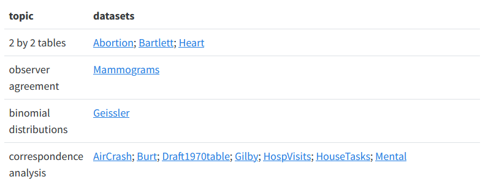

# How to link to help files in R package vignettes and pkgdown

I'm trying to classify datasets in an R package according to methods of
analysis and present these in a table organized by method, with links to 
dataset documentation, e.g., help(dataset) that will work with
a `pkgdown` site, https://friendly.github.io/vcdExtra/

The method I'm using and the current result is shown as a vignette:
https://friendly.github.io/vcdExtra/articles/datasets.html 

However, the links to the datasets do not work.
E.g., the link to the Abortion data appears as
https://friendly.github.io/vcdExtra/articles/help(Abortion),
but the actual documentation is in 
https://friendly.github.io/vcdExtra/reference/Abortion.html

I was following the `pkgdown`
documentation for [auto-linking](https://pkgdown.r-lib.org/articles/linking.html)
but it seems that auto-linking only works in text, not in a table, at least the
way I've set this up.

