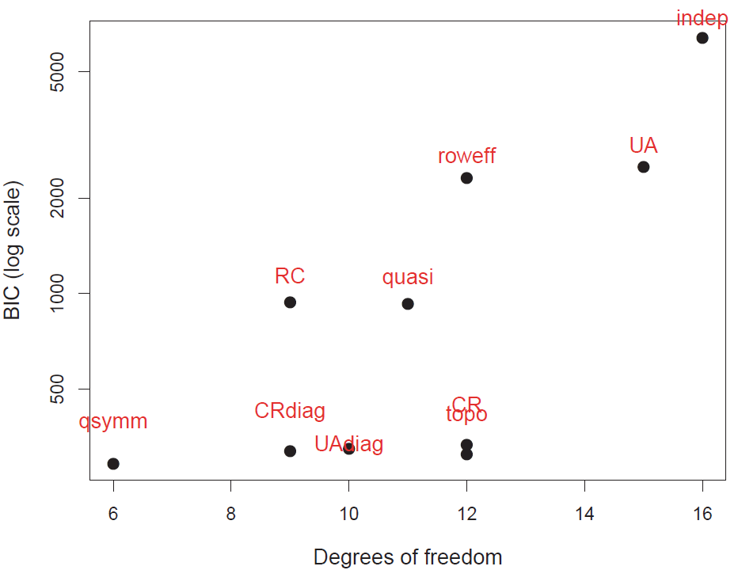

```{r setup, include = FALSE}
knitr::opts_chunk$set(
  collapse = TRUE,
  message = FALSE,
  warning = FALSE,
  fig.height = 6,
  fig.width = 7,
#  fig.path = "fig/mobility-",
  dev = "png",
  comment = "##"
)

# save some typing
knitr::set_alias(w = "fig.width",
                 h = "fig.height",
                 cap = "fig.cap")

# colorize text
colorize <- function(x, color) {
  if (knitr::is_latex_output()) {
    sprintf("\\textcolor{%s}{%s}", color, x)
  } else if (knitr::is_html_output()) {
    sprintf("<span style='color: %s;'>%s</span>", color,
      x)
  } else x
}
```

## Social mobility

Social mobility is an important concept in sociology, and its' study has led to
a wide range of developments in categorical data analysis in what are often called
_mobility tables_. 

The idea is to study the movement of individuals, families, households or other categories of people within or between social strata in a society, across time or space. This refers to
a change in social status relative to one's current social location within a given society.

Using survey data, the most frequent examples relate to changes in income or wealth, but most often this is studied via classification in occupational categories ("professional, "managerial", "skilled manual", ...). Most often this is studied _intergenerationaly_ using the occupational
categories of fathers and sons.

Mobility tables are nearly always _square_ tables, with the same categories for the row
and column variables. As such, they nearly always exhibit positive associations
along the diagonal cells.  What is of interest are specialized models, intermediate
between the null model of independence and the saturated model.

### Models

These models include important special cases:

- **quasi-independence**: Ignoring diagonal cells, are the row and column variables independent?
- **symmetry**: Are associations above the diagonal equal to the corresponding ones below the diagonal?
- **row effects, col effects, linear x linear**: Typically, the factors in such tables are ordinal. To what extent can the models be simplified by assigning integer scores to the
row, column categories or both?
- **multiplicative RC**: RC models attempt to estimate the scores for the row and column categories. 
- **topographical models**: It is possible that the associations among occupational categories
exhibit consistent patterns according to their nature. These models allow specifying a
theoretically interesting pattern.
- **crossings models**: assert that there are different difficulty parameters for crossing from category to the next and associations between categories decrease with their separation.

While standard loglinear models can be fit using `MASS::loglm`, these models require
use of ``stats::glm()` or `gnm::gnm()`, as I illustrate below.

## Hauser data

This vignette uses the `vcdExtra::Hauser79` dataset, a cross-classification of 19,912 individuals by father's occupation and son's first occupation for U.S. men aged 20-64 in 1973.
The data comes from @Hauser:79 and has been also analysed by @PowersXie:2008.
The discussion draws on @FriendlyMeyer:2016:DDAR, Ch. 10.

```{r hauser-data}
data("Hauser79", package="vcdExtra")
str(Hauser79)
(Hauser_tab <- xtabs(Freq ~ Father + Son, data=Hauser79))
```

As can be seen, `Hauser79` is a data.frame in frequency form.
The factor levels in this table are a coarse grouping of occupational categories, so:

- `UpNM` = professional and kindred workers, managers and officials, and non-retail sales workers;
- `LoNM` = proprietors, clerical and kindred workers, and retail sales workers; 

- `UpM` = craftsmen, foremen, and kindred workers;

- `LoM` =  service workers, operatives and kindred workers, and laborers (except farm); 

- `Farm` = farmers and farm managers, farm laborers, and foremen.

### Load packages

```{r load}
library(vcdExtra)
library(gnm)
library(dplyr)
```

### Mosaic plots

`Hauser_tab` is a `table` object, and the
simplest plot for the frequencies is the default `plot()` method, giving a `graphics::mosaicplot()`.

```{r mosaicplot}
plot(Hauser_tab, shade=TRUE)
```

The frequencies are first split according to father's occupational category 
(the first table dimension) and then by sons' occupation.
The most common category for fathers is lower manual, followed by farm.

`mosaicplot()`, using `shade=TRUE` colors the tiles according to the 
sign and magnitude of the residuals from an independence model: shades of 
`r colorize("positive", "blue")` for positive residuals and
`r colorize("negative", "red")` red for negative residuals.

`vcd::mosaic()` gives a similar display, but is much more flexible in the labeling of
the row and column variable, labels for the categories, and the scheme used for shading
the tiles. Here, I simply assign longer labels for the row and column variables,
using the `labeling_args` argument to `mosaic()`.

```{r mosaic1}
labels <- list(set_varnames = c(Father="Father's occupation", 
                                Son="Son's occupation"))

mosaic(Freq ~ Father + Son, data=Hauser79,
       labeling_args = labels,
       shade=TRUE,
       legend = FALSE)
```

### Fitting and graphing models

The call to `vcd::mosaic()` above takes the `Hauser79` dataset as input.
Internally, it fits the model of independence and displays the result,
but for more complex tables, control of the fitted model is limited.

Unlike `mosaicplot()` and even the [`ggmosaic`]( https://CRAN.R-project.org/package=ggmosaic) package,
`vcdExtra::mosaic.glm()` is a `mosaic` **method** for `glm` objects.
This means you can fit any model, and supply the model object to `mosaic()`.
(Note that in `mosaic()`, the `formula` argument determines the order of
splitting in the mosaic, not a loglinear formula.)

```{r indep}
hauser.indep <- glm(Freq ~ Father + Son, 
  data=Hauser79, 
  family=poisson)

# the same mosaic, using the fitted model
mosaic(hauser.indep, formula = ~ Father + Son, 
       labeling_args = labels,
       legend = FALSE,
       main="Independence model")
```

## Quasi-independence

Among the most important advances from the social mobility literature is the idea that
associations between row and column variables in square tables can be explored in greater
depth if we ignore the obvious association in the diagonal cells.
The result is a model of _quasi-independence_, asserting that fathers' and sons' occupations
are independent, ignoring the diagonal cells. 

For a two-way table, quasi-independence can be expressed as
$$
 \pi_{ij} = \pi_{i+} \pi_{+j} \quad\quad \mbox{for } i\ne j
$$
or in loglinear form as:
$$
 \log m_{ij} = \mu + \lambda_i^A + \lambda_j^B + \delta_i I(i=j)
 \quad .
$$
This model effectively adds one parameter, $\delta_i$, for each main diagonal cell
and fits those frequencies perfectly.


In the [`gnm`]( https://CRAN.R-project.org/package=gnm) package,
`gnm::Diag()` creates the appropriate term in the model formula,
using a symbol in the diagonal cells and "." otherwise.

```{r Diag}
# with symbols
with(Hauser79, Diag(Father, Son)) |> matrix(nrow=5)
```

We proceed to fit and plot the quasi-independence model by updating the
independence model, adding the term `Diag(Father, Son)`.
```{r quasi}
hauser.quasi <-  update(hauser.indep, 
                        ~ . + Diag(Father, Son))

mosaic(hauser.quasi, ~ Father+Son, 
       labeling_args = labels,
       legend = FALSE,
       main="Quasi-independence model")

```

Note that the pattern of residuals shows a systematic pattern of 
`r colorize("positive", "blue")` and 
`r colorize("negative", "red")` residuals above and below the diagonal tiles.
We turn to this next.

### Symmetry and quasi-symmetry

Another advance from the social mobility literature was the idea of how to test for 
_differences_ in occupational categories between fathers and sons.
The null hypothesis of no systematic differences can be formulated as a 
test of **symmetry** in the table, 
$$
 \pi_{ij} = \pi_{ji} \quad\quad \mbox{for } i\ne j \quad ,
$$
which asserts that sons are as likely to move from their father's occupation $i$
to another category $j$ as they were to move in the reverse direction, $j$ to $i$.
An alternative, "Upward mobility",
i.e., that sons who did not stay in their father's occupational category moved
to a higher category on average would mean that 
$$
 \pi_{ij} < \pi_{ji} \quad\quad \mbox{for } i\ne j
$$
Yet this model is overly strong, because it also asserts **marginal homogeneity**,
that the marginal probabilities of row and column values are equal,
$\pi_{i+} = \pi_{+i}$ for all $i$. Consequently, this hypothesis is most often
tested as a model for **quasi-symmetry**, that also ignores the diagonal cells.

Symmetry is modeled by the function `gnm::Symm()`. It returns a factor with
the same labels for positions above and below the diagonal.

```{r symm}
with(Hauser79, Symm(Father, Son)) |> matrix(nrow=5)
```

To fit the model of quasi-symmetry, add both `Diag()` and `Symm()` to the model of independence.
```{r qsymm}
hauser.qsymm <-  update(hauser.indep, 
                        ~ . + Diag(Father,Son) + Symm(Father,Son))
```

To compare the models so far, we can use `anova()` or `vcdExtra::LRstats():

```{r anova1}
anova(hauser.indep, hauser.quasi, hauser.qsymm, test="Chisq")

LRstats(hauser.indep, hauser.quasi, hauser.qsymm)
```

This `hauser.qsymm` model represents a huge improvement in goodness of fit.
With such a large sample size, it might be considered an acceptable
fit.

But, this model of quasi-symmetry still shows some residual lack of fit.
To visualize this in the mosaic, we can label the cells with their
standardized residuals.
```{r qsymm-mosaic}
mosaic(hauser.qsymm, ~ Father+Son, 
       labeling_args = labels,
       labeling = labeling_residuals,
       residuals_type ="rstandard",
       legend = FALSE,
       main="Quasi-symmetry model")
```

The cells with the largest lack of symmetry (using standardized residuals)
are those for the upper and lower non-manual occupations, where the son of
an upper manual worker is less likely to move to lower non-manual
work than the reverse.

### Topological models

It is also possible that there are more subtle patterns of association one
might want to model, with specific parameters for particular combinations of the
occupational categories (beyond the idea of symmetry).
@Hauser:79 developed this idea in what are now called
**topological** models or **levels** models, where an arbitrary pattern of
associations can be specified, implemented in `gnm::Topo()`.

```{r topo-levels}
# Levels for Hauser 5-level model
levels <- matrix(c(
      2,  4,  5,  5,  5,
      3,  4,  5,  5,  5,
      5,  5,  5,  5,  5,
      5,  5,  5,  4,  4,
      5,  5,  5,  4,  1), 
      nrow = 5, ncol = 5, 
      byrow=TRUE)
```

```{r topo-mosaic}
hauser.topo <- update(hauser.indep, 
                      ~ . + Topo(Father, Son, spec=levels))

mosaic(hauser.topo, ~Father+Son, 
       labeling_args = labels,
       labeling = labeling_residuals,
       residuals_type ="rstandard",
       legend = FALSE,
       main="Topological model")
```

Comparing models, we can see that the model of quasi-symmetry is the best
so far, using AIC as the measure:

```{r}
LRstats(hauser.indep, hauser.quasi, hauser.qsymm, hauser.topo, sortby = "AIC")

```

## Ordinal tables

Because the factors in mobility tables are ordered, another
path to simplifying the saturated model is to consider assigning
numerical scores (typically consecutive integers) to the categories. 

When both variables are assigned scores, this gives the **linear-by-linear model**,
$$
\log ( m_{ij} ) = \mu  +  \lambda_i^A
+  \lambda_j^B  +  \gamma \: a_i b_j \quad ,
$$
where $a_i$ and $b_j$ are the row and column numeric scores.
This model is also called the model of **uniform association** [@Goodman:79]
because,
for integer scores, $a_i=i$, $b_j=j$, 
this model has only one extra parameter, $\gamma$, which is the
common odds local ratio.
The independence model is the special case, $\gamma=0$.  In contrast,
the saturated model, allowing general association $\lambda_{ij}^{AB}$,
uses $(I-1)(J-1)$ additional parameters.

For square tables, like mobility tables, this model can be amended to include
a diagonal term, `Diag()`


```{r scores}
Sscore <- as.numeric(Hauser79$Son)
Fscore <- as.numeric(Hauser79$Father)

Hauser79 |> cbind(Fscore, Fscore) |> head()
```

To fit this model, I use `Fscore * Sscore` for the linear x linear
association and add `Diag(Father, Son)` to fit the diagonal cells
exactly.
```{r hauser-UAdiag}
hauser.UAdiag <- update(hauser.indep,
                        . ~ . + Fscore : Sscore + Diag(Father, Son))

LRstats(hauser.UAdiag)
```

In this model, the estimated common local log odds ratio---the
coefficient $\gamma$ for the linear-by-linear term
`Fscore:Sscore`, is given by:
```{r}
coef(hauser.UAdiag)[["Fscore:Sscore"]]
```

For comparisons not involving the diagonal cells,
each step down the scale of occupational categories for the father
multiplies the odds that the son will also be in one lower
category by $\exp (0.158) = 1.172$, an increase of 17%.

But this model does not seem to be any improvement over quasi-symmetry.
From the pattern of residuals in the mosaic, we see a number of large
residuals of various signs in the lower triangular, where the son's
occupation is of a higher level than that of the father.
```{r UAdiag-mosaic}
mosaic(hauser.UAdiag, ~ Father+Son, 
       labeling_args = labels,
       labeling = labeling_residuals,
       residuals_type ="rstandard",
       legend = FALSE,
       main="Uniform association + Diag()")
```

## Model comparison plots

Finally, for comparing a largish collection of models, a model comparison plot
can show the trade-off between goodness-of-fit and parsimony by plotting
measures like $G^2/df$, AIC, or BIC against
degrees of freedom. The plot below, including quite a few more models, uses a log scale for BIC to emphasize differences among better fitting models. (The code for this plot is shown
on p. 399 of @FriendlyMeyer:2016:DDAR).

{width=80%}


## References

